# el9800hw.c

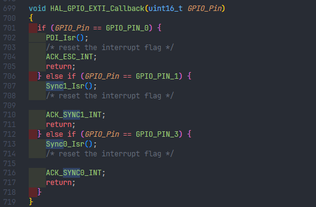

在这里，可以看到所有和 ESC 相关的中断函数

---

# 补充一点hal库外部中断的系统学习

重写这个函数

```c
HAL_GPIO_EXTI_Callback(uint16_t GPIO_Pin);
```

使用外部中断不需要手动清除标志位

调用逻辑为：

stm32f4xx_it.c 中

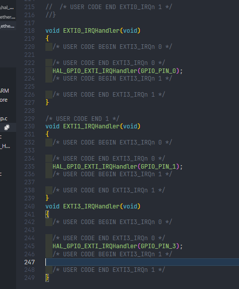

会去调用：

```c
HAL_GPIO_EXTI_IRQHandler(uint16_t GPIO_Pin);
```

然后看看它：stm32f4xx_hal_gpio.c 中

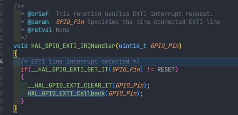

可以看到调用了

```c
__HAL_GPIO_EXTI_CLEAR_IT(GPIO_Pin);// 清除标志位
```

然后就调用

```c
HAL_GPIO_EXTI_Callback(GPIO_Pin);// 用户自定义的中断回调函数
```

---


这里的RST指的其实是给LAN9252复位用的RST

而非单片机上的Reset

（一直在这里疑惑！）

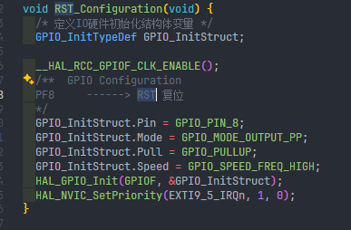

原理图中可见：

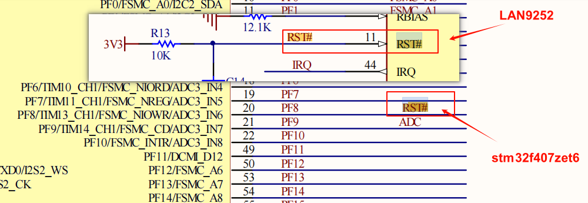

确实是设计为PF8了

---

HAL库 SPI 代码：

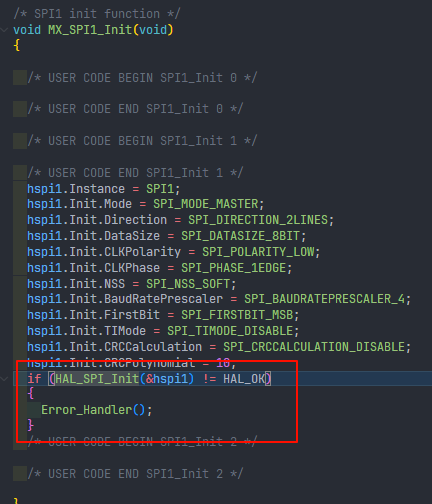

然后在这个HAL_SPI_Init中调用了


所以看起来 hal库 是先 准备好 spi 的结构体

然后配置spi 引脚，最后结合初始化

---

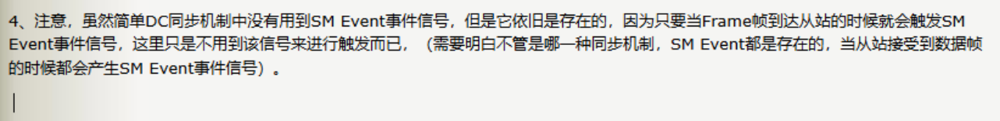

---

捋一下 api

先看 开发板源码中的 esc_hw

最底层：

```c
void SPIWrite(UINT8 data);// 支持的是单个的uint8 类型
UINT8 SPIRead(void);// 支持的是单个的uint8 类型，这和soes库中所给的api是两种不同的做法
```

然后这两个函数，被包装为：

```c
#define SPIWriteByte SPIWrite
#define SPIReadByte() SPIRead()
```

所以在下面的api中，它们是这样被调用的`SPIWriteByte`、`SPIReadByte()`

接着是：向ESC发字大小的数据以及从ESC读字大小的数据

先注意到，其使用两个union来实现数据自动装填

```c
/* 将32位数据拆解为小字节 */
typedef union {
  uint32_t Val;
  uint8_t v[4];
  uint16_t w[2];
  struct {
    uint8_t LB;
    uint8_t HB;
    uint8_t UB;
    uint8_t MB;
  } byte;
} UINT32_VAL;

/* 将16位数据拆解为小字节 */
typedef union {
  uint16_t Val;
  struct {
    uint8_t LB;
    uint8_t HB;
  } byte;
} UINT16_VAL;
```

然后，它就有了所谓的一些“快捷函数接口”

```c
void SPIWriteBurstMode(uint32_t Val) {
  UINT32_VAL dwData;
  dwData.Val = Val;

  // Write Bytes
  SPIWriteByte(dwData.byte.LB);
  SPIWriteByte(dwData.byte.HB);
  SPIWriteByte(dwData.byte.UB);
  SPIWriteByte(dwData.byte.MB);
}
UINT32 SPIReadBurstMode() {
  UINT32_VAL dwResult;
  // Read Bytes
  dwResult.byte.LB = SPIReadByte();
  dwResult.byte.HB = SPIReadByte();
  dwResult.byte.UB = SPIReadByte();
  dwResult.byte.MB = SPIReadByte();

  return dwResult.Val;
}
```

其实就是原来刚刚实现的那个最底层接口它一次只能接收一个uint8 类型的数据，然后发送接收

所以它就多做了一个，用来一次性发送与一次性接收 4字节数据的接口

再看看它同样用在了哪里？

```c
// write address to lan9252
void SPISendAddr(uint16_t Address) {
  UINT16_VAL wAddr;

  wAddr.Val = Address;
  // Write Address
  SPIWriteByte(wAddr.byte.HB);
  SPIWriteByte(wAddr.byte.LB);
}
```


```c
uint32_t SPIReadDWord(uint16_t Address) {
  UINT32_VAL dwResult;// 存取接收数据，方便将接收到的4个uint8_t 组合成为uint32_t
  UINT16_VAL wAddr;// 储存地址，方便将地址分为高8位和低8位进行拆分

  wAddr.Val = Address;
  // Assert CS line
  CSLOW();  // 开启片选
  // Write Command
  SPIWriteByte(CMD_FAST_READ);
  // Write Address
  SPIWriteByte(wAddr.byte.HB);// 先发高8位
  SPIWriteByte(wAddr.byte.LB);// 再发低8位

  // Dummy Byte
  SPIWriteByte(CMD_FAST_READ_DUMMY);// 发送Dummy位

  // Read Bytes 开始读取（用了四次其实是因为一次只能读一个uint8_t）
  dwResult.byte.LB = SPIReadByte();// 从最低8位开始储存
  dwResult.byte.HB = SPIReadByte();
  dwResult.byte.UB = SPIReadByte();
  dwResult.byte.MB = SPIReadByte();
  // De-Assert CS line
  CSHIGH();// 拉高，结束片选

  return dwResult.Val;// union特性，自动将刚刚接收到的数据组合成为一个uint32_t类型数据返回
}

void SPIWriteDWord(uint16_t Address, uint32_t Val) {
  UINT32_VAL dwData;  // 创建一个32位的可拆分体
  UINT16_VAL wAddr;   // 创建一个16位的可拆分体

  wAddr.Val = Address;  // 存放地址值
  dwData.Val = Val;     // 转存
  // Assert CS line
  CSLOW();
  // Write Command
  SPIWriteByte(CMD_SERIAL_WRITE);
  // Write Address
  SPIWriteByte(wAddr.byte.HB);
  SPIWriteByte(wAddr.byte.LB);
  // Write Bytes
  SPIWriteByte(dwData.byte.LB);
  SPIWriteByte(dwData.byte.HB);
  SPIWriteByte(dwData.byte.UB);
  SPIWriteByte(dwData.byte.MB);

  // De-Assert CS line
  CSHIGH();
}
```

然后是，特定功能（需要结合ESC的一些指令要求以及寄存器）

```c
void SPIReadRegUsingCSR(uint8_t *ReadBuffer, uint16_t Address, uint8_t Count) {
  UINT32_VAL param32_1 = {0};  // 创建一个32位的可拆分体
  UINT8 i = 0;
  UINT16_VAL wAddr;     // 创建一个16位的可拆分体
  wAddr.Val = Address;  // 本体值存放

  param32_1.v[0] = wAddr.byte.LB;  // 将Address 的低8位装填
  param32_1.v[1] = wAddr.byte.HB;  // 将Address 的高8位装填
  param32_1.v[2] = Count;          // Count其实就是长度
  param32_1.v[3] = ESC_READ_BYTE;  //  0xC0

  SPIWriteDWord(ESC_CSR_CMD_REG, param32_1.Val);// 调用刚刚所说的那个一次性发送word大小数据

  do {
      // 进来先读一下是否busy
    param32_1.Val = SPIReadDWord(ESC_CSR_CMD_REG);// 然后从ESC_CSR_CMD_REG等待接收1个word大小的数据

  } while (param32_1.v[3] & ESC_CSR_BUSY);// 如果 spi上寄存器中busy被置位，则继续重新进入循环直到不busy
  // 不busy了，读数据
  param32_1.Val = SPIReadDWord(ESC_CSR_DATA_REG);// 从ESC_CSR_DATA_REG等待接收1个word大小的数据
	
  for (i = 0; i < Count; i++) ReadBuffer[i] = param32_1.v[i];// 将读到的数据存到用户传入的buffer中

  return;
}
```

```c
void SPIWriteRegUsingCSR(uint8_t *WriteBuffer, uint16_t Address,
                         uint8_t Count) {
  UINT32_VAL param32_1 = {0};
  UINT8 i = 0;
  UINT16_VAL wAddr;

  for (i = 0; i < Count; i++) param32_1.v[i] = WriteBuffer[i];// 将要发送的writeBuffer中的数据一一传入

  SPIWriteDWord(ESC_CSR_DATA_REG, param32_1.Val);// 一次性发送4字节数据

  wAddr.Val = Address;// 存地址

  param32_1.v[0] = wAddr.byte.LB;
  param32_1.v[1] = wAddr.byte.HB;
  param32_1.v[2] = Count;
  param32_1.v[3] = ESC_WRITE_BYTE;

  SPIWriteDWord(0x304, param32_1.Val);// 发送字数据
  do {
    param32_1.Val = SPIReadDWord(0x304);

  } while (param32_1.v[3] & ESC_CSR_BUSY);

  return;
}
```

---

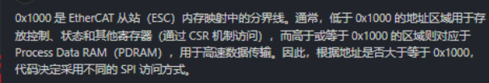

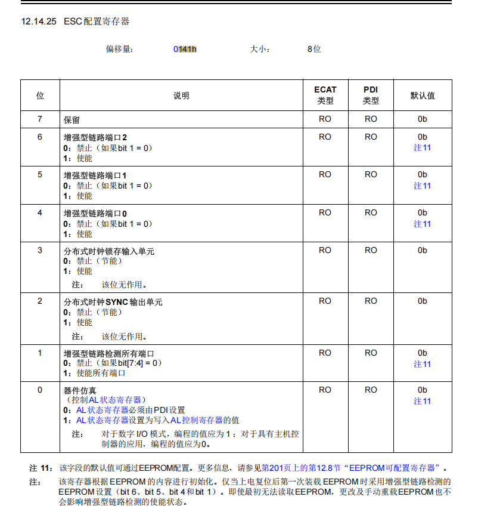

对应的代码：

```c
#define ESCREG_ESC_CONFIG 0x0141           // esc寄存器，供读取 检查 DC使能标志
{
  uint8_t data = 0x00;

  // check DC Sync Out bit: 0x140:10 检查DC使能标志 0141h
  ESC_read(ESCREG_ESC_CONFIG, &data, sizeof(data));
  if (!(data &
        DC_SYNC_OUT)) {  // 使用位掩码检查DC使能标志（DC_SYNC_OUT是0x04，那也就是检查data的第三位（从0开始计数））
    return 0;            // DC sync is not enabled in ESI
  }
}
```

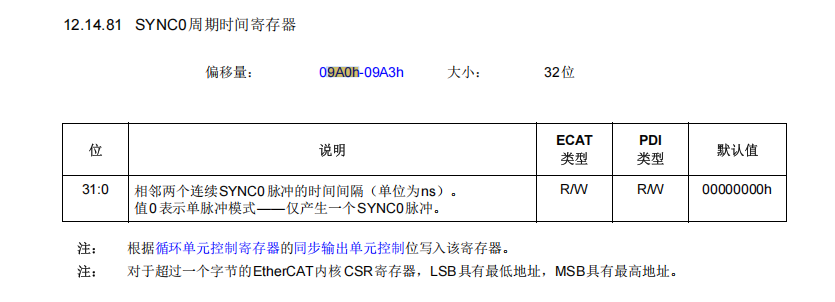

对应代码：

```c
 #define ESCREG_SYNC0_CYCLE_TIME \
  0x09A0  // 该寄存器用于存放SYNC0（第一个同步信号）的周期时间，通过读取该地址，可以获得SYNC0信号的间隔时间（通常单位为纳秒）
{
// read set SYNC0 Cycle Time from 0x09A0
  uint32_t setsync0cycleTime = 0;
  ESC_read(ESCREG_SYNC0_CYCLE_TIME, &setsync0cycleTime, sizeof(uint32_t));  // 读取SYNC0的周期时间
  setsync0cycleTime = etohl(setsync0cycleTime);
}
```

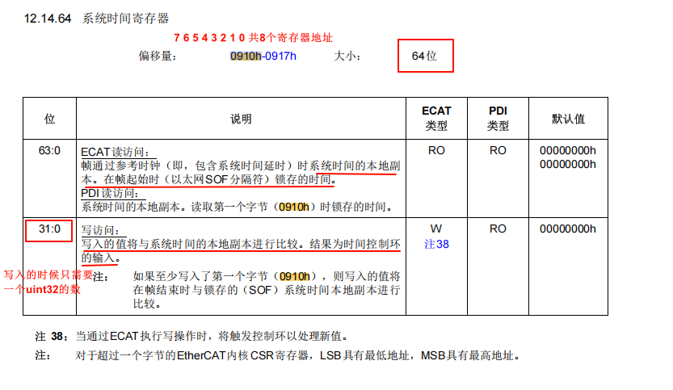

对应代码：

```c
#define ESCREG_LOCALTIME 0x0910  // 本地时间寄存器
{
    // set sync start time: read system time, add offset for writing start time and activation
    /* 配置同步起始时间与激活同步 */
    ESC_read(ESCREG_LOCALTIME, (void *)&ESCvar.Time, sizeof(ESCvar.Time));
    ESCvar.Time = etohl(ESCvar.Time);
    uint32_t startTime = ESCvar.Time + SYNC_START_OFFSET;  // 配置同步起始时间

    ESC_write(ESCREG_SYNC_START_TIME, &startTime, sizeof(startTime));
}
```

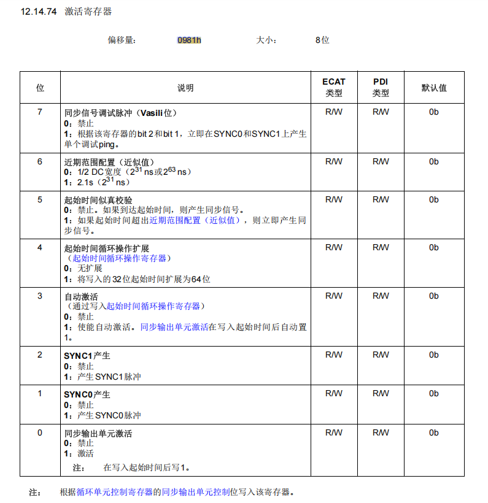

对应代码：

```c
#define ESCREG_SYNC_ACT 0x0981
{
    // activate cyclic operation and SYNC0 激活同步
    ESC_read(ESCREG_SYNC_ACT, &data, sizeof(data));
    data = data | ESCREG_SYNC_ACT_ACTIVATED | ESCREG_SYNC_SYNC0_EN;
    ESC_write(ESCREG_SYNC_ACT, &data, sizeof(data));
    data = 0x00;
    while (!(data & (ESCREG_SYNC_ACT_ACTIVATED | ESCREG_SYNC_SYNC0_EN))) {
      ESC_read(ESCREG_SYNC_ACT, &data, sizeof(data));
    }
}
```

---

对应ECAT理论知识：同步单元如果是分配给ECAT，那么

```c
/**
 * @brief 用于启用分布式时钟DC同步
 *
 * @return uint32_t SYNC0的周期时间
 */
uint32_t ESC_enable_DC() {
  uint8_t data = 0x00;

  // check DC Sync Out bit: 0x140:10 检查DC使能标志
  ESC_read(ESCREG_ESC_CONFIG, &data, sizeof(data));
  if (!(data &
        DC_SYNC_OUT)) {  // 使用位掩码检查DC使能标志（DC_SYNC_OUT是0x04，那也就是检查data的第三位（从0开始计数））
    return 0;            // DC sync is not enabled in ESI
  }

  // read set SYNC0 Cycle Time from 0x09A0
  uint32_t setsync0cycleTime = 0;
  ESC_read(ESCREG_SYNC0_CYCLE_TIME, &setsync0cycleTime, sizeof(uint32_t));  // 读取SYNC0的周期时间
  setsync0cycleTime = etohl(setsync0cycleTime);                             // 将读取到的周期时间转换为主机字节序

  // check Sync Unit assign 0x0980:0 ( 0 for ECAT, 1 for PDI )
  ESC_read(ESCREG_CYCLIC_UNIT_CONTROL, &data, sizeof(data));  // 检查同步单元分配给PDI 还是 ECAT
  if (data == SYNC_OUT_PDI_CONTROL) {                         // 如果 同步单元配置给了PDI，那么同步信号将由从站来控制
    // Sync Unit assigned to PDI, configuration needs to be finished by slave

    // set sync start time: read system time, add offset for writing start time and activation
    /* 配置同步起始时间与激活同步 */
    ESC_read(ESCREG_LOCALTIME, (void *)&ESCvar.Time, sizeof(ESCvar.Time));
    ESCvar.Time = etohl(ESCvar.Time);
    uint32_t startTime = ESCvar.Time + SYNC_START_OFFSET;  // 配置同步起始时间
    ESC_write(ESCREG_SYNC_START_TIME, &startTime, sizeof(startTime));

    // activate cyclic operation and SYNC0 激活同步
    ESC_read(ESCREG_SYNC_ACT, &data, sizeof(data));  // 读取0981h寄存器的配置，是一个8位的数据
    data = data | ESCREG_SYNC_ACT_ACTIVATED |
           ESCREG_SYNC_SYNC0_EN;                      // 然后对寄存器上的对应数据做使能，得到一个新的寄存器配置
    ESC_write(ESCREG_SYNC_ACT, &data, sizeof(data));  // 将寄存器配置再次写入
    data = 0x00;                                      // 清空缓存
    while (
        !(data &
          (ESCREG_SYNC_ACT_ACTIVATED |
           ESCREG_SYNC_SYNC0_EN))) {  // 0x00 & (0x01 | 0x02) --- > data & (0001 | 0010) --- > 检查data的前两位是否为1
                                      /* 如果接收到的data不合预期，就一直读 */
      ESC_read(ESCREG_SYNC_ACT, &data, sizeof(data));
    }
  }
  DPRINT("cycle time: %lu ns\r\n", setsync0cycleTime);
  return setsync0cycleTime;
}

```

---

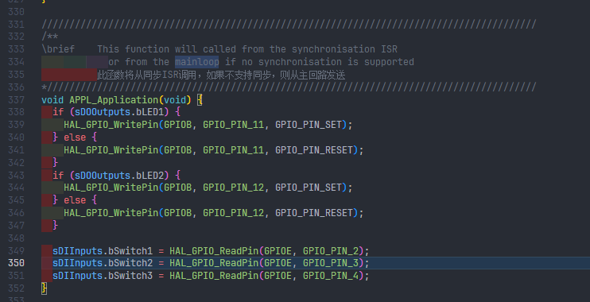

```c
  if ((!bEscIntEnabled || !bEcatFirstOutputsReceived) /* SM-Synchronous, but not
                                                         SM-event received */
      && !bDcSyncActive /* DC-Synchronous */) {
    /* if the application is running in ECAT Synchron Mode the function
       ECAT_Application is called from the ESC interrupt routine (in mcihw.c or
       spihw.c), in ECAT Synchron Mode it should be additionally checked, if the
       SM-event is received at least once (bEcatFirstOutputsReceived = 1),
       otherwise no interrupt is generated and the function ECAT_Application has
       to be called here (with interrupts disabled, because the SM-event could
       be generated while executing ECAT_Application) */
    if (!bEscIntEnabled) {
      /* application is running in ECAT FreeRun Mode,
         first we have to check, if outputs were received
         应用程序正在Ecat FreeRun模式下运行，首先，我们必须检查是否收到了输出 */
      UINT16 ALEvent = HW_GetALEventRegister();
      ALEvent = SWAPWORD(ALEvent);

      if (ALEvent & PROCESS_OUTPUT_EVENT) {
        /* set the flag for the state machine behaviour */
        bEcatFirstOutputsReceived = TRUE;
        if (bEcatOutputUpdateRunning) {
          /* update the outputs */
          PDO_OutputMapping();
        }
      } else if (nPdOutputSize == 0) {
        /* if no outputs are transmitted, the watchdog must be reset, when the
         * inputs were read */
        if (ALEvent & PROCESS_INPUT_EVENT) {
          /* Outputs were updated, set flag for watchdog monitoring */
          bEcatFirstOutputsReceived = TRUE;
        }
      }
    }

    DISABLE_ESC_INT();
    ECAT_Application();

    if (bEcatInputUpdateRunning) {
      /* EtherCAT slave is at least in SAFE-OPERATIONAL, update inputs
       * 从站至少处于safe-operational，更新inputs */
      PDO_InputMapping();
    }
    ENABLE_ESC_INT();
  }
```

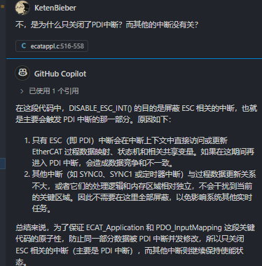

---

开发工具：

ssc 生成xml 以及 从站相关代码：

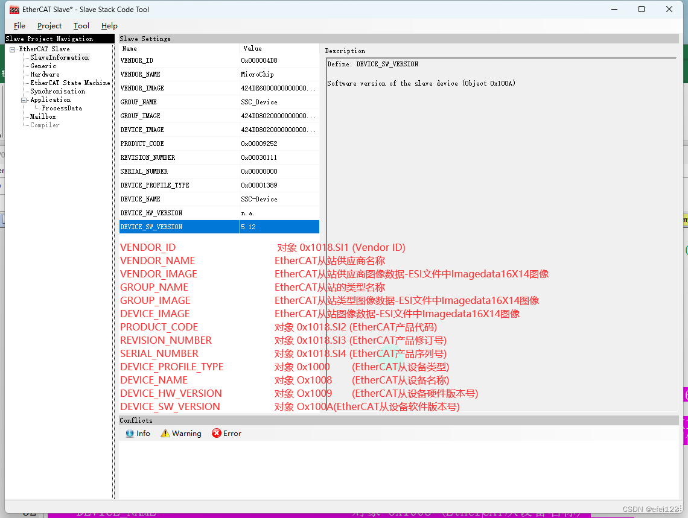


然后是Application 部分：

先声明概念：输出和输入都是相对主站来说的，所以说“输出”，也就是主站对从站下达的“命令”，对从站来说也就是RxPDO


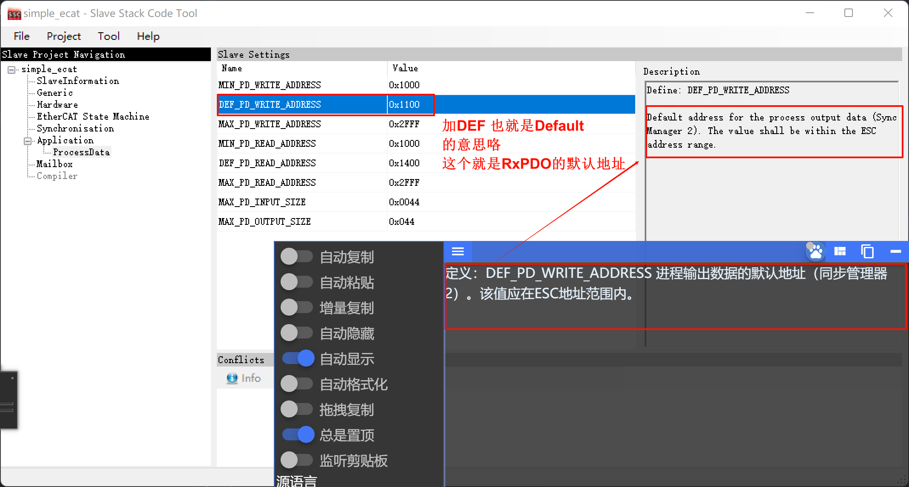

