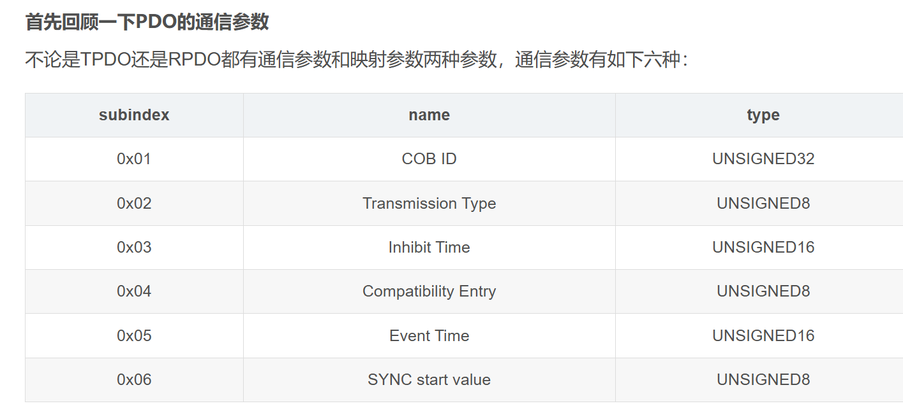
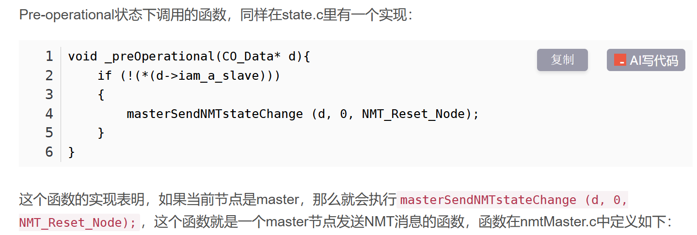
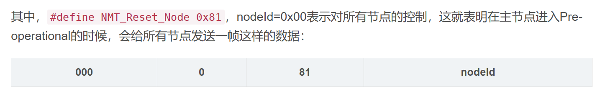
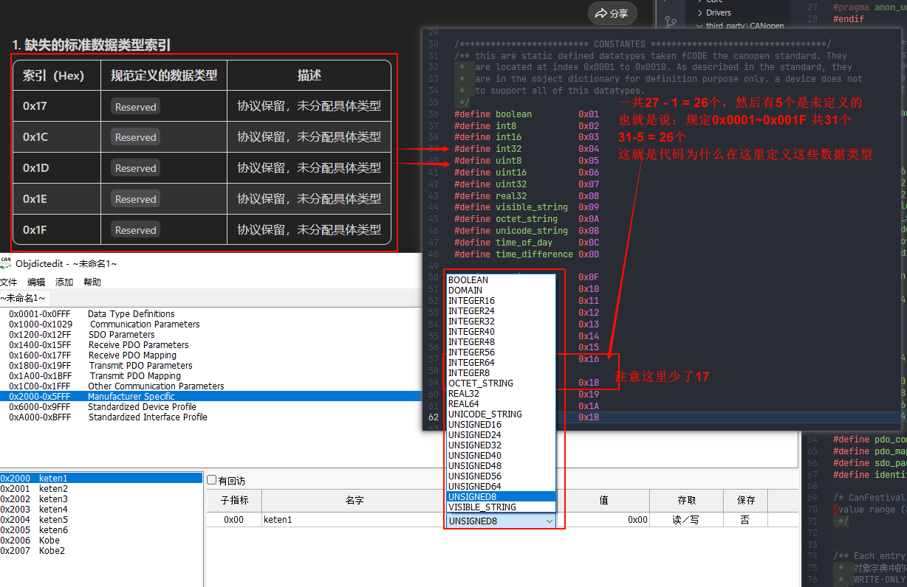

*下面是梳理 canfestival 源码 的 学习过程*

# 1. 重要结构体

## 1.1 节点数据结构体

`data.h`

```c

/**
 * @ingroup od
 * @brief This structure contains all necessary informations to define a CANOpen node 
 *        CANopen 中最核心的一个结构体
 *        包含了一个CANopen节点的所有必要信息
 */
struct struct_CO_Data {
    /* Object dictionary 对象字典 */
    UNS8 *bDeviceNodeId;// 即Node_ID ，范围是0-127，并且 0 不能作为NODE-ID
    const CONSTSTORE indextable *objdict;// 用来存放每个对象的索引，根据索引就能找到真正存放对象数据的位置
    s_PDO_status *PDO_status;
    TIMER_HANDLE *RxPDO_EventTimers;
    void (*RxPDO_EventTimers_Handler)(CO_Data*, UNS32);
    const CONSTSTORE quick_index *firstIndex; // first index in OD for specified entry
    const CONSTSTORE quick_index *lastIndex; // last index in OD for specified entry
    const CONSTSTORE UNS16 *ObjdictSize;
    const UNS8 *iam_a_slave;
    valueRangeTest_t valueRangeTest;
    
    /* SDO */
    s_transfer transfers[SDO_MAX_SIMULTANEOUS_TRANSFERS];
    /* s_sdo_parameter *sdo_parameters; */

    /* State machine */
    e_nodeState nodeState;
    s_state_communication CurrentCommunicationState;
    initialisation_t initialisation;
    preOperational_t preOperational;
    operational_t operational;
    stopped_t stopped;
     void (*NMT_Slave_Node_Reset_Callback)(CO_Data*);
     void (*NMT_Slave_Communications_Reset_Callback)(CO_Data*);
     
    /* NMT-heartbeat */
    UNS8 *ConsumerHeartbeatCount;
    UNS32 *ConsumerHeartbeatEntries;
    TIMER_HANDLE *ConsumerHeartBeatTimers;
    UNS16 *ProducerHeartBeatTime;
    TIMER_HANDLE ProducerHeartBeatTimer;
    heartbeatError_t heartbeatError;
    e_nodeState NMTable[NMT_MAX_NODE_ID]; 

    /* NMT-nodeguarding */
    TIMER_HANDLE GuardTimeTimer;
    TIMER_HANDLE LifeTimeTimer;
    nodeguardError_t nodeguardError;
    UNS16 *GuardTime;
    UNS8 *LifeTimeFactor;
    UNS8 nodeGuardStatus[NMT_MAX_NODE_ID];

    /* SYNC */
    TIMER_HANDLE syncTimer;
    UNS32 *COB_ID_Sync;
    UNS32 *Sync_Cycle_Period;
    /*UNS32 *Sync_window_length;;*/
    post_sync_t post_sync;
    post_TPDO_t post_TPDO;
    post_SlaveBootup_t post_SlaveBootup;
    post_SlaveStateChange_t post_SlaveStateChange;
    
    /* General */
    UNS8 toggle;
    CAN_PORT canHandle;    
    scanIndexOD_t scanIndexOD;
    storeODSubIndex_t storeODSubIndex; 
    
    /* DCF concise */
    const CONSTSTORE indextable* dcf_odentry;
    //union {
        UNS8* dcf_cursor;
        //const CONSTSTORE UNS8* dcf_cursor_const;
    //};
    UNS32 dcf_entries_count;
    UNS8 dcf_status;
    UNS32 dcf_size;
    UNS8* dcf_data;
    
    /* EMCY */
    e_errorState error_state;
    UNS8 error_history_size;
    UNS8* error_number;
    UNS32* error_first_element;
    UNS8* error_register;
    UNS32* error_cobid;
    s_errors error_data[EMCY_MAX_ERRORS];
    post_emcy_t post_emcy;
    
#ifdef CO_ENABLE_LSS
    /* LSS */
    lss_transfer_t lss_transfer;
    lss_StoreConfiguration_t lss_StoreConfiguration;
#endif    
};
```

逐个模块进行解析：

### 1.1.1 Object Dictionary

```c
  /* Object dictionary 对象字典 */
    UNS8 *bDeviceNodeId;// 即Node_ID ，范围是0-127，并且 0 不能作为NODE-ID
    const CONSTSTORE indextable *objdict;// 用来存放每个对象的索引，根据索引就能找到真正存放对象数据的位置
    s_PDO_status *PDO_status;
    TIMER_HANDLE *RxPDO_EventTimers;
    void (*RxPDO_EventTimers_Handler)(CO_Data*, UNS32);
    const CONSTSTORE quick_index *firstIndex; // first index in OD for specified entry
    const CONSTSTORE quick_index *lastIndex; // last index in OD for specified entry
    const CONSTSTORE UNS16 *ObjdictSize;
    const UNS8 *iam_a_slave;
    valueRangeTest_t valueRangeTest;
```

`const CONSTSTORE indextable *objdict;// 用来存放每个对象的索引，根据索引就能找到真正存放对象数据的位置`

结构体源码：

`objdictdef.h`

```c
/** Struct for creating entries in the communictaion profile
 */
typedef struct td_indextable
{
    const CONSTSTORE subindex* const  pSubindex;   /* Pointer to the subindex */
    const UNS8   bSubCount;   /* the count of valid entries for this subindex 子索引的数量
                         * This count here defines how many memory has been
                         * allocated. this memory does not have to be used.
                         */
    const UNS16   index;/* 表示索引 */
} indextable;
```

`const CONSTSTORE subindex* const  pSubindex;` 保存子索引的相关信息，在CANopen中，每个对象都有16位的索引和8位的子索引

再看看subindex，同样在`objdictdef.h` 下：

```c
typedef struct td_subindex
{
    const UNS8              bAccessType;// 权限：RW、RO、WO
    const UNS8              bDataType; /* Defines of what datatype the entry is 表示这个对象里面存储数据的数据类型 */
    UNS32             size;      /* The size (in Byte) of the variable */
    union {
        void*          pObject;   /* This is the pointer of the Variable */
        const CONSTSTORE void* const pObjectConst;
    };
} subindex;
```

接着看PDO structure

`pdo.h`

```c
typedef struct struct_s_PDO_status s_PDO_status;

/* Handler for RxPDO event timers : empty function that user can overload */
void _RxPDO_EventTimers_Handler(CO_Data *d, UNS32 pdoNum);

/* Status of the TPDO : */
#define PDO_INHIBITED 0x01
#define PDO_RTR_SYNC_READY 0x01

/** The PDO structure */
struct struct_s_PDO_status {
    UNS8 transmit_type_parameter;
    TIMER_HANDLE event_timer;
    TIMER_HANDLE inhibit_timer;
    Message last_message;
};
```

可以看出这个结构体实际上保存了PDO的通信参数，只会保存TPDO 的参数，不会保存RPDO 的参数；




### 1.1.2 SDO 

```c
struct struct_s_transfer {
  UNS8           CliServNbr; /**< The index of the SDO client / server in our OD minus 0x1280 / 0x1200 */

  UNS8           whoami;     /**< Takes the values SDO_CLIENT or SDO_SERVER */
  UNS8           state;      /**< state of the transmission : Takes the values SDO_... */
  UNS8           toggle;    
  UNS32          abortCode;  /**< Sent or received */
  /**< index and subindex of the dictionary where to store */
  /**< (for a received SDO) or to read (for a transmit SDO) */
  UNS16          index;
  UNS8           subIndex;
  UNS32          count;      /**< Number of data received or to be sent. */
  UNS32          offset;     /**< stack pointer of data[]
                              * Used only to tranfer part of a line to or from a SDO.
                              * offset is always pointing on the next free cell of data[].
                              * WARNING s_transfer.data is subject to ENDIANISATION
                              * (with respect to CANOPEN_BIG_ENDIAN)
                              */
  UNS8           data [SDO_MAX_LENGTH_TRANSFER];
#ifdef SDO_DYNAMIC_BUFFER_ALLOCATION
  UNS8           *dynamicData;
  UNS32          dynamicDataSize;
#endif //SDO_DYNAMIC_BUFFER_ALLOCATION
                                    
  UNS8           peerCRCsupport;    /**< True if peer supports CRC */
  UNS8           blksize;           /**< Number of segments per block with 0 < blksize < 128 */
  UNS8           ackseq;            /**< sequence number of last segment that was received successfully */
  UNS32          objsize;           /**< Size in bytes of the object provided by data producer */
  UNS32          lastblockoffset;   /**< Value of offset before last block */
  UNS8           seqno;             /**< Last sequence number received OK or transmitted */   
  UNS8           endfield;          /**< nbr of bytes in last segment of last block that do not contain data */
  rxStep_t       rxstep;            /**< data consumer receive step - set to true when last segment of a block received */
  UNS8           tmpData[8];        /**< temporary segment storage */

  UNS8           dataType;   /**< Defined in objdictdef.h Value is visible_string
                              * if it is a string, any other value if it is not a string,
                              * like 0. In fact, it is used only if client.
                              */
  TIMER_HANDLE   timer;      /**< Time counter to implement a timeout in milliseconds.
                              * It is automatically incremented whenever
                              * the line state is in SDO_DOWNLOAD_IN_PROGRESS or
                              * SDO_UPLOAD_IN_PROGRESS, and reseted to 0
                              * when the response SDO have been received.
                              */
  SDOCallback_t  Callback;   /**< The user callback func to be called at SDO transaction end */
};
```


### 1.1.3 state machine

```c
    /* State machine */
    e_nodeState nodeState;// 节点状态
    s_state_communication CurrentCommunicationState;// 保存是否开启对应功能的标志
    initialisation_t initialisation;/* funcptr：initialisation状态时会调用的函数 */
    preOperational_t preOperational;/* funcptr：preOperational状态时会调用的函数 */
    operational_t operational;/* funcptr：operational状态时会调用的函数 */
    stopped_t stopped;/* funcptr：stopped状态时会调用的函数 */
     void (*NMT_Slave_Node_Reset_Callback)(CO_Data*);/* callbackFunc：节点复位时会调用的函数 */
     void (*NMT_Slave_Communications_Reset_Callback)(CO_Data*);/* callbackFunc：通信复位时会调用的函数 */
```

在这其中，特别是initialisation 和 operational 只提供了空实现，也就是说用户可以自行实现，然后注册到节点结构体中



```c
/*!
**
**
** @param d
** @param nodeId
** @param cs
**
** @return
**/
UNS8 masterSendNMTstateChange(CO_Data* d, UNS8 nodeId, UNS8 cs)
{
  Message m;

  MSG_WAR(0x3501, "Send_NMT cs : ", cs);
  MSG_WAR(0x3502, "    to node : ", nodeId);
  /* message configuration */
  m.cob_id = 0x0000; /*(NMT) << 7*/
  m.rtr = NOT_A_REQUEST;
  m.len = 2;
  m.data[0] = cs;
  m.data[1] = nodeId;

  return canSend(d->canHandle,&m);
}
```







