# 1. SPI （**Serial Peripheral interface**）

EtherCAT从站 = stm32 使用SPI 和esc 从站处理器通讯 

**高速的，全双工，同步**的通信总线，并且在芯片的管脚上只占用四根线，节约了芯片的管脚，同时为PCB的布局上节省空间，提供方便，主要应用在 EEPROM，FLASH，实时时钟，AD转换器，还有数字信号处理器和数字信号解码器之间


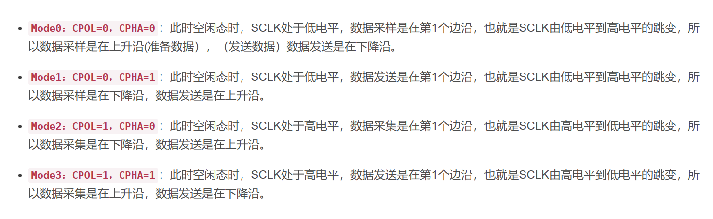

# 2. SOEM 主站


# 3. SOES 从站

## SOES 库工作内容

- ESC（EtherCAT Slave Controller）硬件初始化
  - ESC 重置
  - ESC 初始化，init SPI
  - 等待 ESC 初始化成功（轮询 ESC 的 DL 寄存器）
- 软件初始化
  - 重置 Slave 状态（覆写 ESC AL 状态寄存器）
  - 重置错误信息 （清除 ESC AL 错误码寄存器）
  - 中止之前的应用层程序（可能有 SyncManager 在 block，等待接收EtherCAT 包）
- 应用
  - 应用层事件（ALevent）处理，ALevent 携带了 ALControl 或 SyncManagers 的更改信息。ALControl 是用来控制状态改变的，SyncManagers 是用来将 EtherCAT 的改动写入到本地内存中的。
  - ESC_state 用来处理状态，例如状态变化、错误处理、告知接收到信息。
  - Mailbox handler，提供应用层协议使用的 mailboxes。
  - 在 mailbox 中，也会检查是否需要使用特定协议的 handler 来处理接收/发送的数据。

COE：CANopen over EtherCAT

SOE：Servo Drive over EtherCAT

EOE：Ethernet over EtherCAT

FOE：File Access over EtherCAT ; 该协议可以使用EtherCAT总线上传、下载固件（也就是BIOS，


## 从站功能

作为现场总线的一部分，一个EtherCAT从站一般至少包含两个任务，一个从主站获取EtherCAT数据，另一个与控制设备（比如电机或CAN总线）交互


---

一点网络知识：

如何查看ubuntu的有线网卡

```
ifconfig
```

除了wl的就是有线的

---

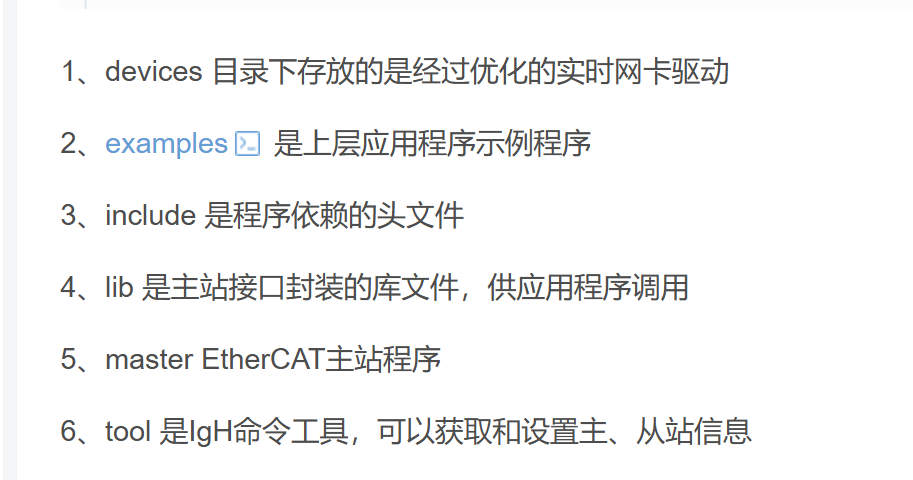

---

# CANopen 协议相关

## PDO 和 SDO

## 服务数据对象SDO

服务数据对象（SDO）通过对象索引 和 子索引 与对象字典建立联系，通过SDO 可以读取**对象字典**中的对象内容，或者在允许的情况下修改对象数据

## SDO传输框架

遵循 客户端-服务端模式，即一问一答方式；由CAN总线网络中的 SDO 客户端发起，SDO服务器作出应答；因此，SDO之间的数据交换至少需要两个CAN报文才能实现，而且两个CAN报文的CAN标识符不一样

## SDO 传输报文

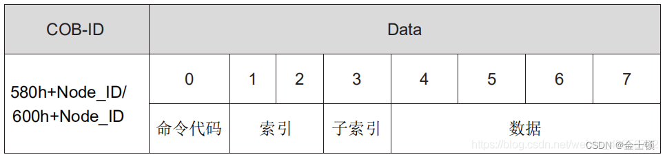

其中，**命令代码指明了该段SDO的传输类型和传输数据长度**，**索引和子索引是对象在列表中的位置**，**数据是该对象的数值**


SDO的传输分为 不高于4个字节 和 高于4个字节 的对象数据传输

不高于4个字节采用 加速SDO传输方式，高于4个字节采用分段传输或块传输方式；

SDO 传输报文由 COB-ID 和数据段组成。由下表 可以看出，T_SDO 和R_SDO 报文的 COB-ID 不一致。**==数据段采用小端模式，即低位在前，高位在后排列。==** 所有的 SDO 报文数据段都必须是 8 个字节COB-ID（Communication Object Identifier）

### SDO 加速读传输报文

当数据大于4个字节时，采用分段读来执行操作，起始发送帧报文结构与加速传输报文保持一致

客户端请求：

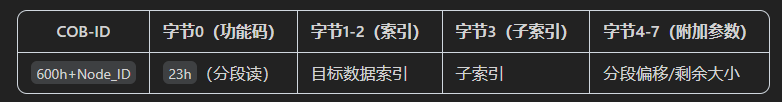

服务端响应

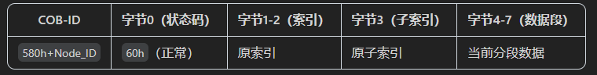

## 过程数据对象 PDO

过程数据对象用来传输实时的数据，是CANopen中最主要的数据传输方式；由于PDO的传输不需要应答，且PDO的长度可以小于8个字节，因此传输速度快

遵循 生产者-消费者 模型，即 CAN总线网络中生产者产生的 TPDO 可根据 COB-ID 由网络上一个或者多个消费者 RPDO 接收 （Transmit 和 Receive）

## PDO的传输类型

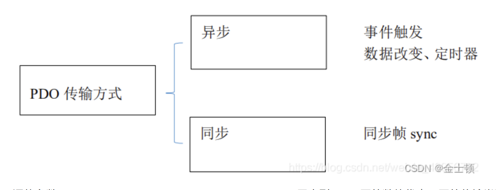

**传输类型0**：

- **触发条件**：映射数据变化 + 收到同步帧。
- **用途**：确保数据更新与主站同步周期严格对齐，适合高精度控制场景（如伺服位置反馈）

**传输类型1~240**：

- **触发条件**：收到指定次数的同步帧（如类型10 = 每10个同步帧发送一次）。
- 经典用法：
  - **周期性上报**：设置类型1，同步帧间隔1ms → 每1ms发送实时数据（如电机转速）。
  - **低频采样**：设置类型100，同步帧间隔1ms → 每100ms发送数据（如温度监控）。

**传输类型254/255**：

- **触发条件**：数据变化 或 事件计时器超时。
- 经典用法：
  - **紧急报警**：类型254，故障信号触发立即发送（如过载报警）。
  - **非周期事件**：类型255，事件计时器设置100ms → 按固定间隔发送日志数据。

**传输类型0~240**：

- **触发条件**：收到同步帧后更新数据。
- 经典用法：
  - **同步控制指令**：类型1，主站每1ms下发指令（如目标位置），从站严格跟随

**传输类型254/255**：

- **触发条件**：直接更新，无需同步帧。
- 经典用法：
  - **紧急指令**：类型255，主站立即下发急停命令，从站无延迟响应

### 禁止时间（Inhibit time）

- 功能：防止高优先级TPDO持续占用CAN总线，确保网络资源公平分配
- **配置位置**：TPDO通信参数（`1800h~1803h`）的子索引`03h`
- 单位：100微秒 （1 单位 = 0.1 ms）
- 规则：设置禁止时间为N，则同一TPDO两次传输间隔 **必须≥N×100us**。
  - 禁止时间设为300 → 最小间隔=300×0.1ms=**30ms**。
  - 若TPDO数据频繁更新，实际传输频率会降低至不短于30ms一次

- 适用场景：多个TPDO竞争总线时，限制高优先级TPDO的发送频率

### 事件计时器

- **功能**：为异步传输（传输类型254/255）的TPDO提供周期性或事件触发机制。
- **配置位置**：TPDO通信参数（`1800h~1803h`）的子索引`05h`。
- **单位**：**毫秒（ms）**。
- 规则：
  - 计时器超时 → 触发TPDO发送。
  - **若数据在计时周期内变化**：立即发送并**复位计时器**。
- 示例：
  - 事件计时器设为100ms → 若数据无变化，每100ms发送一次；若数据在50ms时变化，立即发送并重新开始100ms计时。
- 适用场景：
  - 需要定期上报状态（如设备心跳信号）。
  - ==数据变化频率不确定时，兼顾实时性与带宽占用==。

禁止时间限制最小间隔，事件计时器定义最大间隔。若事件触发频率高于禁止时间，实际间隔以禁止时间为准

<u>事件定时器 和 禁止时间（Inhibit time） 通常一起协作使用：</u>

例如：事件定时器设为50ms 时，若数据在抑制时间（如 10ms ） 内未变化，则每50ms 强制发送一次最新数据


---

## TCP/IP 协议栈

 TCP/IP 协议栈 主要分为四层：应用层、传输层、网络层、数据链路层

每层都有相应的协议

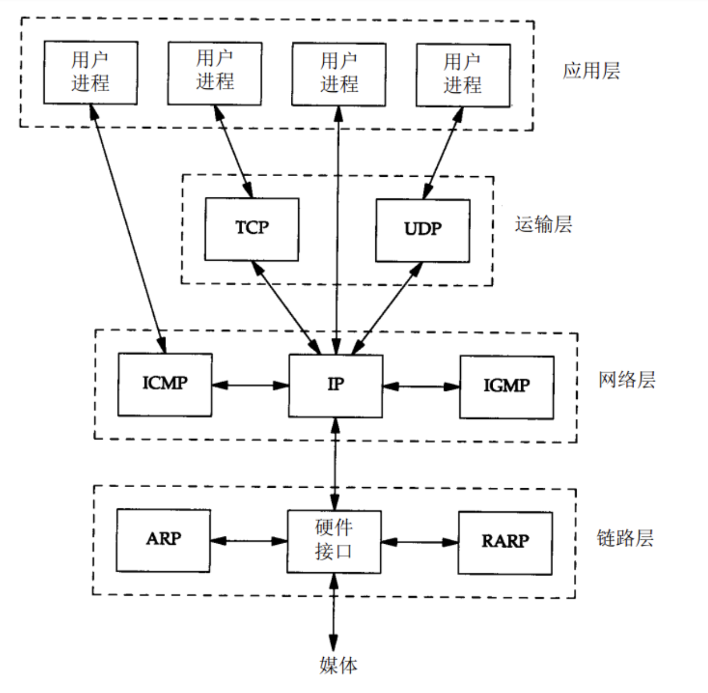

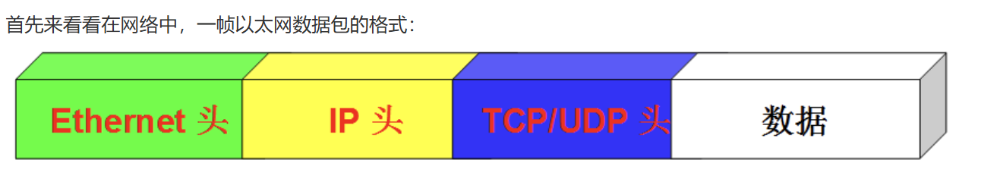

在Linux操作系统中，当我们想要发送数据的时候，我们只需要在上层准备好数据，然后提交给内核协议栈，内核协议栈自动添加相应的协议头

## TCP 协议

TCP协议是面向连接、保证高可靠性(数据无丢失、数据无失序、数据无错误、数据无重复到达)传输层协议


分析一下TCP头的格式 以及 每一个字段的含义：

- 端口号[16bit]：网络实现的就是不同主机的进程间通信，在一个操作系统中，有很多进程；当数据到来时要提交给哪个进程进行处理呢？这个时候就需要端口号。在TCP头中，分有源端口号（Source Port）和 目标端口号 （Destination Port）；源端口号标识了发送主机的进程,目标端口号标识接受方主机的进程。
- 序号[32bit]：序号分为 **发送序号(Sequence Number)** 和 **确认序号（Acknowledgment Number）**

## CANopen 在 ISO 层级中的位置

在OSI的 7 层网络模型的角度来看：CAN 线程总线仅仅定义了第一层（物理层）、第二层（数据链路层），且完全由硬件完成

但CAN没有定义应用层，也就是没有规定与实际应用相关的逻辑

所以需要一个开放的、标准化的高层协议，：这个协议支持各种CAN厂商 设备的互用性、互换性，能够实现在CAN网络中提供标准的、统一的系统通讯模式，提供 设备功能描述方式，执行网络管理功能。其中包括：   应用层(Application layer)：为网络中每一个有效设备都能够提供一组有用的服务与协议。   通讯描述(Communication profile)：提供配置设备、通讯数据的含义，定义数据通讯方式。  设备描述(Device proflile)：为设备（类）增加符合规范的行为

CANopen协议通常分为**用户应用层**、**对象字典**以及 **通信**三个部分

**CANfestival** 对象字典工具查看：

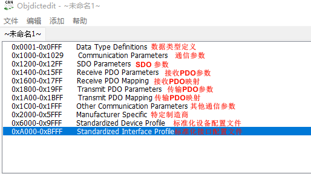

对应我们的理论知识：

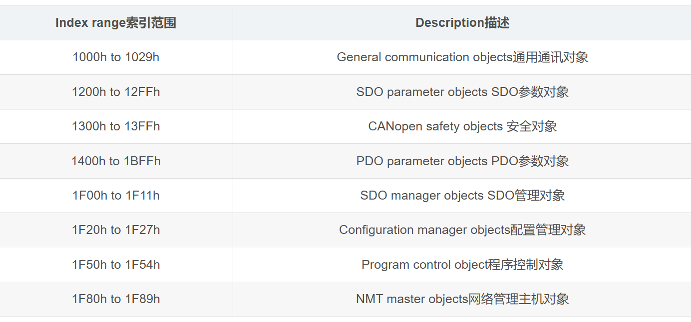

###  数据类型(Data Types)

对象字典中的数据类型部分(0001h-0FFFh)的条目不存储任何变量；它们仅用于定义数据类型

- 如果在节点种物理实现了这些条目（entry），读取这些条目会返回该数据类型的字节大小
- 如果该节点中未使用该数据类型，则返回错误
- 此机制允许配置工具读取数据类型部分，以确定节点中实际使用了哪些数据类型

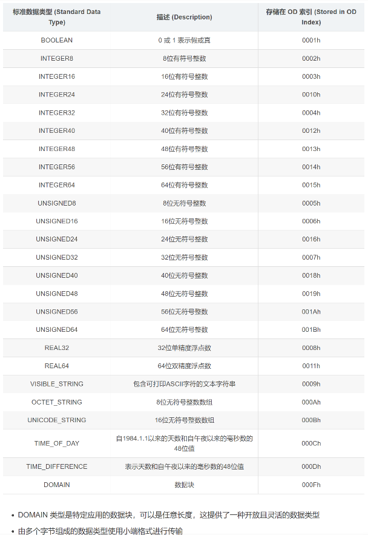

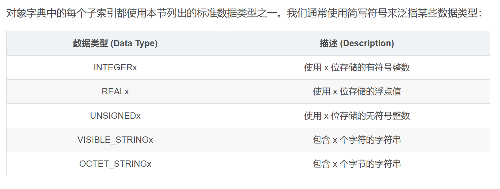

此外，CANopen 规范定义了两类基本数据类型：标准数据类型 和 复杂数据类型 

在实现 CANopen 节点时，**可以在对象字典的制造商复杂数据类型部分定义自定义复杂数据类型**

> **例子**：
>
> 假设我们希望在对象字典中存储一个当前温度值。我们可以在对象字典条目2000h处使用REAL32类型。回想一下，每个对象字典条目必须至少有一个使用子索引00h的子条目。因此，在索引2000h，子索引00h处，数据类型将为REAL32
>
> ---
>
> 一个CANopen节点也可以允许读取定义标准数据类型的对象字典条目。当读取这些条目时，它们返回数据类型的位大小。例如，类型UNSIGNED16在对象字典条目0006h处定义。当读取条目0006h时，它可以返回值16
>
> ---
>
> 复杂数据类型示例
>
> 假设我们希望存储错误消息的详细信息。我们需要知道错误编号和错误消息的文本。为此，我们可以定义一个名为ERROR_MESSAGE的复杂数据类型：
>
> UNSIGNED16：错误编号
> VISIBLE_STRING：错误文本
> 一旦定义了该类型，我们就可以在对象字典中使用它。例如，我们可以定义对象字典条目2000h - 200Fh的类型为ERROR_MESSAGE，以创建一个存储16条错误消息的位置。对象字典条目2000h的子索引如下：
>
> 子索引00h - 存储值2，表示最高子索引为2
> 子索引01h - 类型为UNSIGNED16
> 子索引02h - 类型为VISIBLE_STRING

在CANopen规范中预定义了四种复杂数据类型：

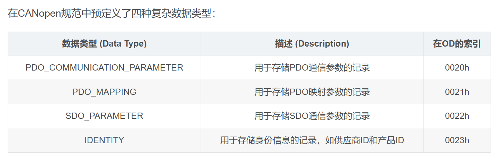

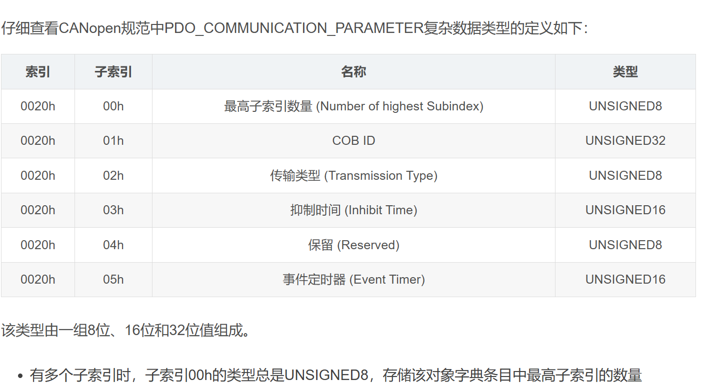


### 通信条目

描述节点使用的CANopen 通信的大部分方面，包括标识、通信参数、PDO 和 SDO 配置等；

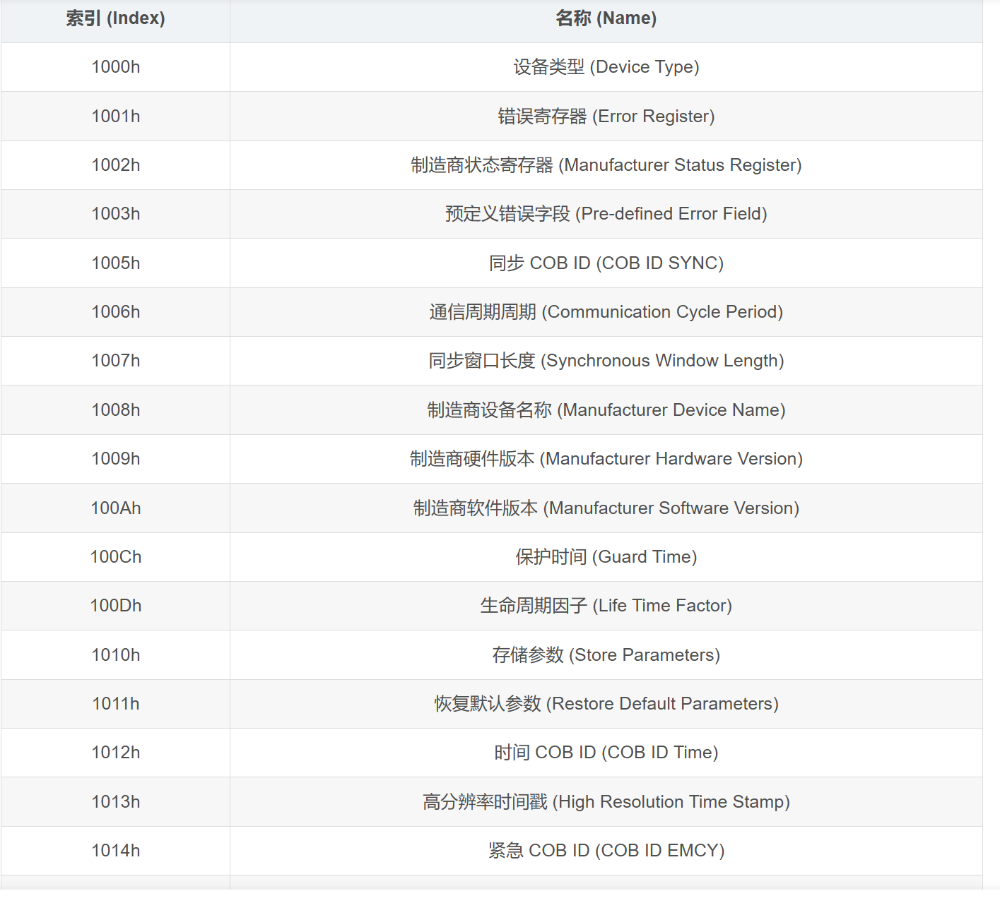

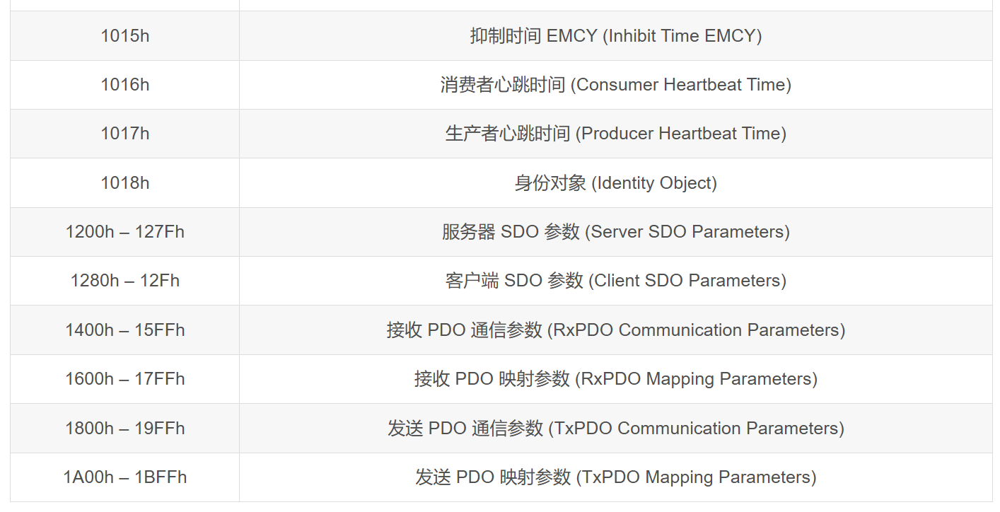

其中强制性条目（必须在节点中实现）如下：


接下来看看代码是怎么体现的：

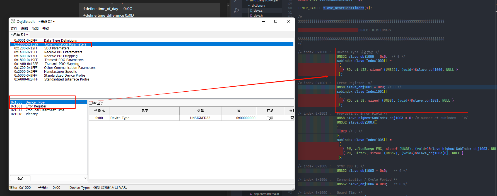


### 多值索引 和 单值索引

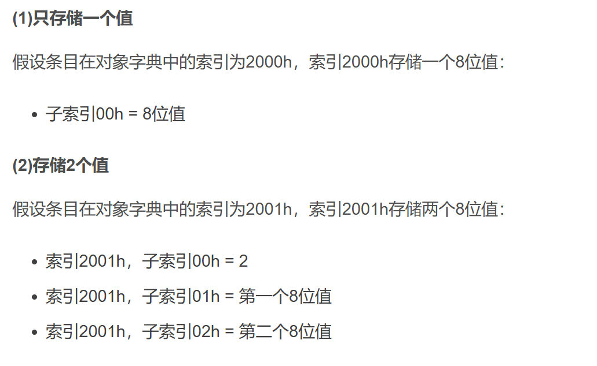


### 标识符 和 对象

标识符identifier 和 对象object 是两个很容易混淆的术语，然而 CANopen 中有许多种 标识符 和 对象，因此识别它们之间的差异至关重要

三种标识符：

- 节点ID ：用于识别特定的CANopen 节点，节点ID 的 允许范围时 1 到 127

- 对象字典的索引和 子索引：用于识别节点内的特定变量（可以是过程数据，也可以是配置数据）

- COB ID （连接对象ID）：主要用于识别网络上的特定消息，此ID直接对应于CAN 消息 ID，

  它有如下特性：

  - 唯一的
  - 用于一个特定的通信通道(从一个节点到一个或多个其他节点)。
  - 可能包含控制位，例如启用/禁用位。

对象

- 对象字典(OD)：以某种查找表的形式存储变量和常量，包括过程数据和配置数据

- 过程数据对象(PDO)：是包含过程数据的消息或帧

- 服务数据对象(SDO)：是包含服务/配置数据的消息或帧

- 连接对象(COB)：COB ID在需要分配消息或帧以实现服务时使用

  例如：每个SDO需要分配两个COB ID，一个用于客户端向服务器发送请求，另一个用于服务器向客户端发送响应。

## PDO 映射概述：

当主站使用EtherCAT协议传输过程数据来控制从站设备时，疑问：主站是在什么时候告诉从站要传输什么过程数据的？

答案：在PDO 映射阶段完成的；PDO 映射 简单来说就是通过COE 协议来访问从站内部的一段结构化的数据，向其中写入数据来告诉从站之后会传输哪些PDO

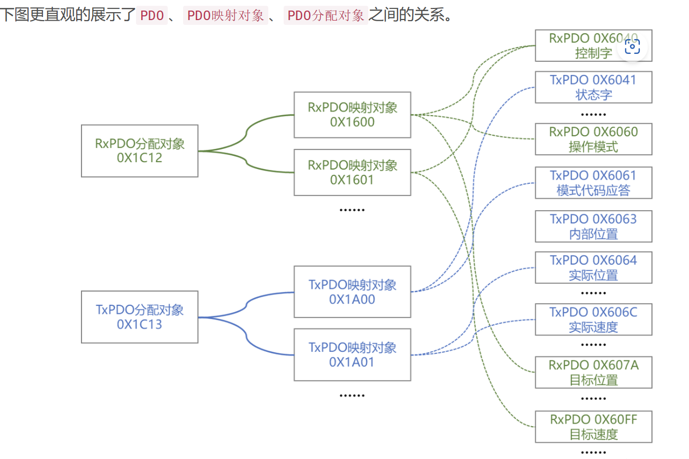

PDO 映射机制 通过 三层结构 实现灵活配置：

1. **PDO 映射对象**

   功能：定义==一组==具体的数据映射关系

   结构：

   - 子索引：0x00 表示映射的数据项数量
   - 子索引：0x01~0x08 每个条目 描述一个映射对象

2. **PDO分配对象**

   功能：从多个PDO映射对象组中 选择 当前生效的组；

   **结构**：

   - **索引0x1C12**：RxPDO分配对象（接收方向）。
   - **索引0x1C13**：TxPDO分配对象（发送方向）。
     - **子索引0x00**：表示实际使用的映射组数量。
     - **子索引0x01-0x04**：存储具体的映射组索引

3. **同步管理器SM**

- 功能：管理PDO数据在物理层与应用层之间的传输通道，确保数据同步
- **配置流程**：清空旧配置→设置SM参数→映射FMMU逻辑地址

PDO 映射对象 和 PDO 分配对象 是与 PDO的 配置相关的两个SDO，虽然名称中带有PDO ，但实际上不属于PDO

### 直接用字典工具查看映射关系：

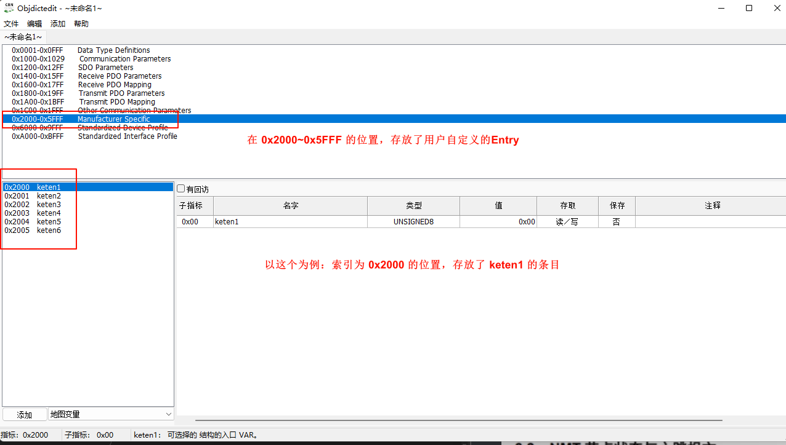

然后完成 RPDO1 的条目配置

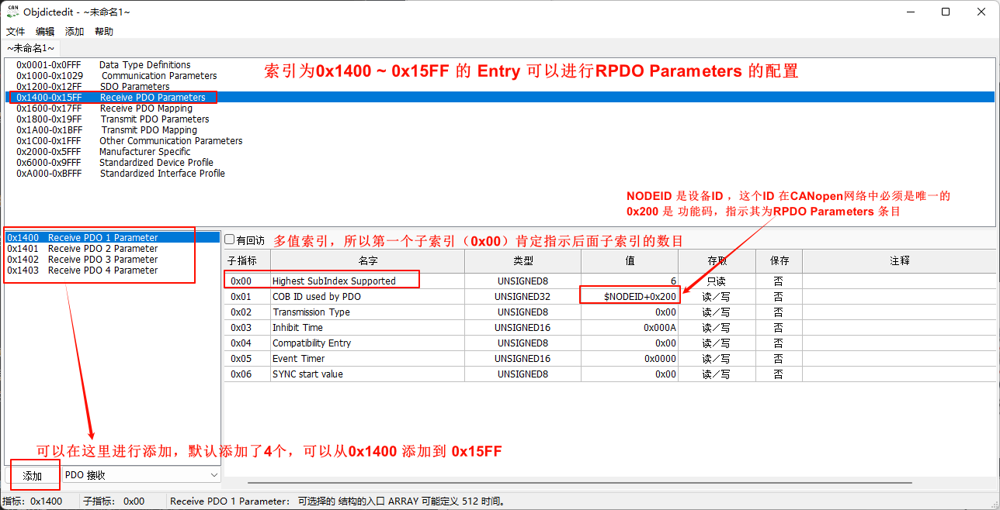

那么同样对于TPDO 也是同样的：

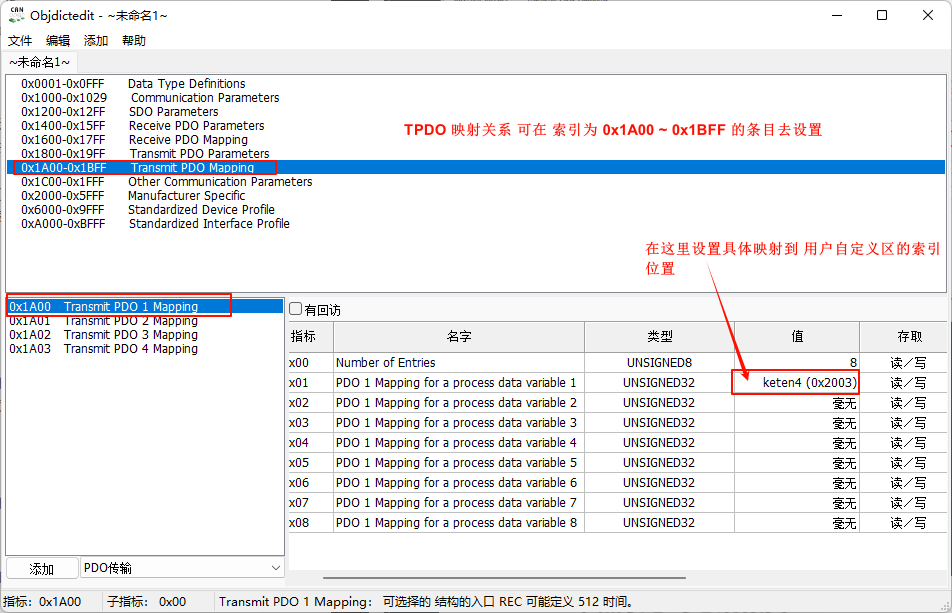

---

### 传输类型Transmission Type

对于PDO 来说：

- **非循环同步（00h）**：仅通过 异步事件（如数据变化或手动请求）触发传输，不受SYNC 信号控制
- **循环同步（01h - FBh）**：根据接收到的SYNC信号数量触发传输。例如：01h 表示每收到一个SYNC信号发送一次，05h表示每5个SYNC 信号触发一次
- 远程同步（FCh)：收到SYNC信号且 PDO 状态位PDO_RTR_SYNC_READY 置位时，立即发送最后一帧数据
- **远程异步（FDh）**：收到PDO（RTR）请求后立即发送数据，无需等待 SYNC信号
- **制造商/设备特定异步（FEh/FFh）** 数据变化时发送，或通过强制请求触发，适用于自定义事件

---

### SDO 服务器功能

当设计一个CANopen 节点（从站）时，必须打开SDO 服务器功能，只有CANopen从站打开 SDO 服务器功能后，CANopen主站才能读写 CANopen从站的对象字典

> 有一些CANopen产品需要在它上电之后，CANopen主站通过SDO指令配置它们的对象字典，让它们达到控制要求。比如心跳报文的频率，还有PDO映射对象，PDO的发送参数等

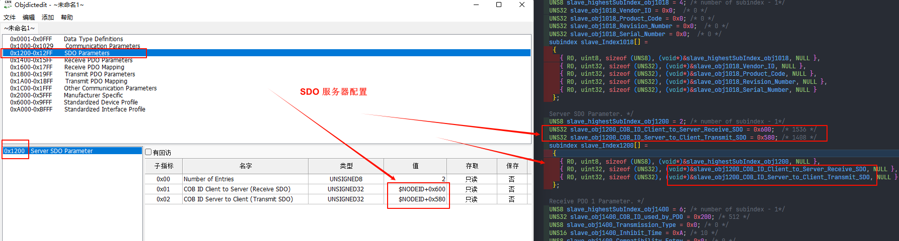

---

### 数据类型

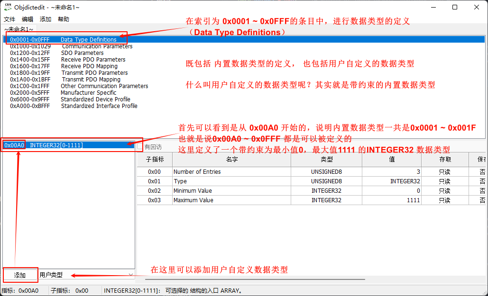


---

## CANopen 中的 NMT

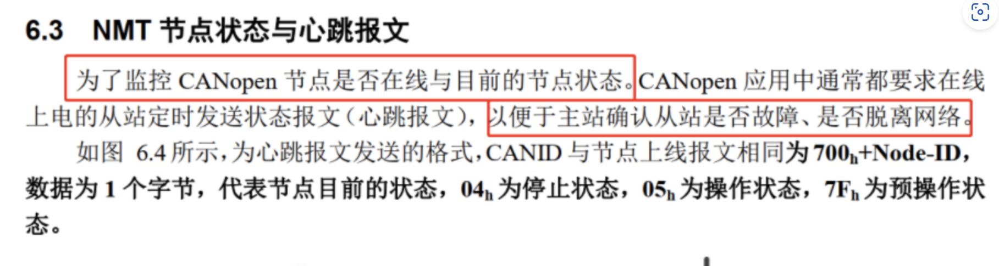

NMT 节点状态：

NMT 管理 涉及到一个 CANopen 节点 从上电开始的 6种状态，包括：

- **初始化（Initialisation）：**节点上电后对功能部件包括CAN控制器进行初始化
- **应用层复位（Application Reset）：**节点中的应用程序复位（开始），比如开关量输 出、模拟量输出的初始值；
- **通讯复位（Communication reset）：**节点中的CANopen通讯复位（开始），从这个时 刻起，此节点就可以进行CANopen通讯了
- **预操作状态（Pre-operational）：**节点的CANopen通讯处于操作就绪状态，<u>此时此节 点不能进行PDO通信</u>，<u>而可以进行SDO进行参数配置和NMT网络管理的操作</u>
- **操作状态（operational）：**节点收到NMT主机发来的启动命令后，CANopen通讯被 激活，PDO通信启动后，按照对象字典里面规定的规则进行传输，同样SDO也可以 对节点进行数据传输和参数修改
- **停止状态（Stopped）：** 节点收到NMT主机发来的停止命令后，节点的PDO通信被 停止，但SDO和NMT网络管理依然可以对节点进行操作

除了初始化状态，NMT 主机 通过NMT 命令可以让网络中任意一个CANopen节点进行其他5种状态的切换

### NMT 节点上线报文

任何一个CANopen 从站上线后，为了提示主站它已经加入网络（便于热插拔），或者 避免与其他从站Node-ID冲突。这个从站必须发出节点上线报文（boot-up），节点上线报文的ID为700h+Node-ID，数据为1个字节0。生产者为CANopen从站

### NMT 节点状态与心跳报文

为了监控CANopen 节点是否在线与目前的节点状态；CANopen 应用中通常都要求在线上电的从站定时发送状态报文（心跳报文），以便于主站确认从站是否故障，是否脱离网络

心跳报文发送的格式，**CANID与节点上线报文相同为700h+Node-ID**， **数据为1个字节，代表节点目前的状态，04h为停止状态，05h为操作状态，7Fh为预操作状态。** 

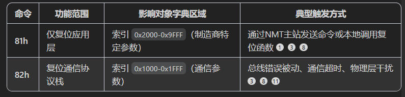

其实复位应用层就是相当于 如果你有一个温度传感器，他有一套内置的参数，然后这套参数被你修改了，当你调用 这个复位应用层的指令，就可以将其还原到出厂设置

当然这个的使用有一点需要注意，后面再说，先看看一些实践：


### NMT 节点状态切换命令

NMT 网络管理中，最核心的就是NMT 节点状态切换命令，这是NMT 主站所进行网络管理的“命令”报文；使用者必须牢记这些命令

CANID 均为 000h ，具备最高的 CAN优先级，数据为两个 字节

**第1个字节代表命令类型：** 

- 01h为启动命令（让节点进入操作状态）； 

- 02h为停止命令（让节点进入停止状态）； 

- 80h为进入预操作状态（让节点进入预操作状态）； 

- 81h为复位节点应用（让节点的应用恢复初始状态，比如列车门都恢复打开状态）； 

- 82h为复位节点通讯（让节点的CAN和CANopen通讯重新初始化，一般用于总线收到 干扰，导致节点总线错误被动，或者总线关闭时）。 

**第二个字节代表被控制的节点Node-ID**

- 如果要对整个网络所有节点同时进行控制，则这个数值为0即可。

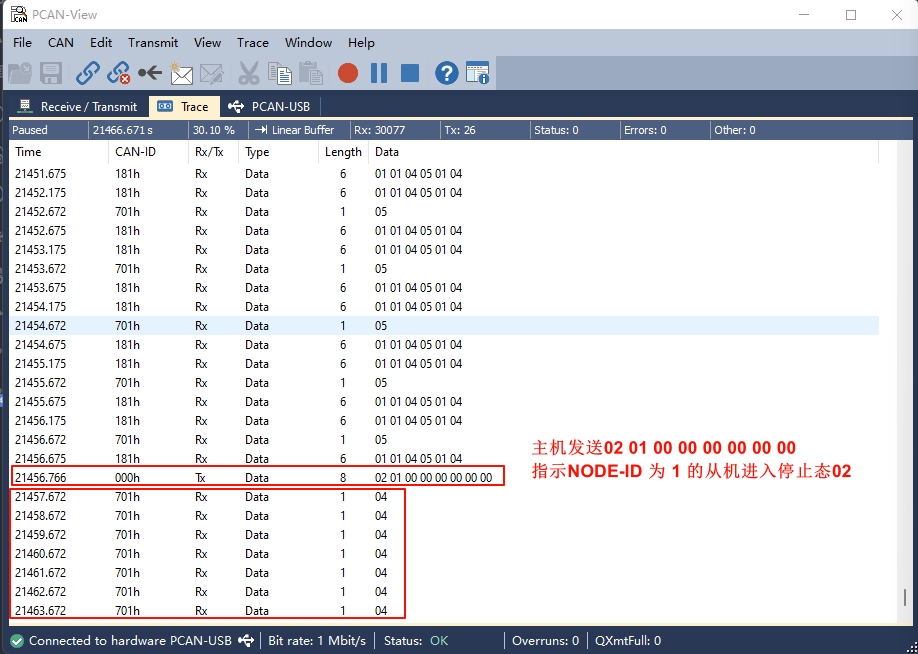

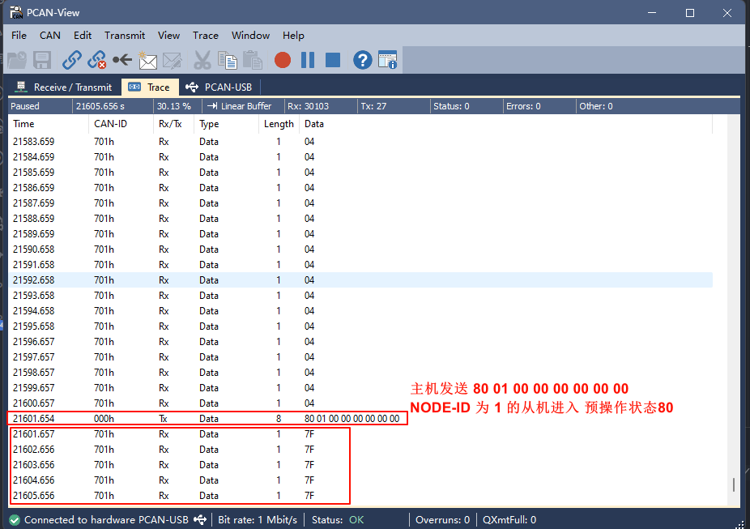

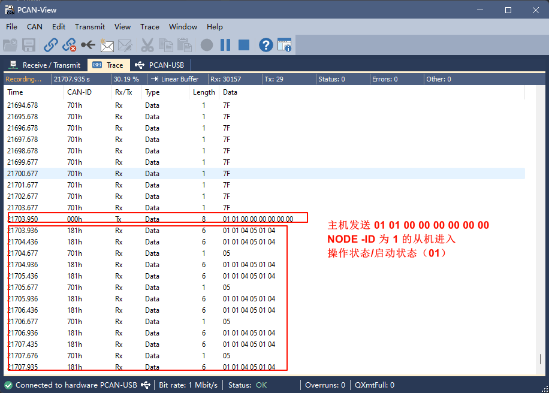

展示一下复位的操作：

几个注意点：

1. 需要在操作状态（Operational）或 预操作状态（Pre-operational）下，这两个命令才有效

   在停止状态（Stopped）下，81h/82h是被拒绝的（停止状态下仅响应 NMT 基础命令如 01h/80h）

2. 在Operational 下，

   - 81h: 立即退出操作状态-> 进入初始化状态->应用层参数重置->自动进入预操作状态（可重新配置参数）

   - 82h：强制关闭PDO 通信 -> 重置波特率 -> 进入初始化状态-> 重新初始化CAN控制器 -> 恢复至 预操作状态

3. 在Pre-operational 下

   - 81h：直接重置应用层参数，状态保持预操作（SDO仍可用）
   - 82h：重置通信参数后需重新配置PDO/SDO通道，状态仍为**预操作**（需手动切换至操作状态）

4. 需要自己重载NMT的两个复位函数，然后注册（太难绷了）

   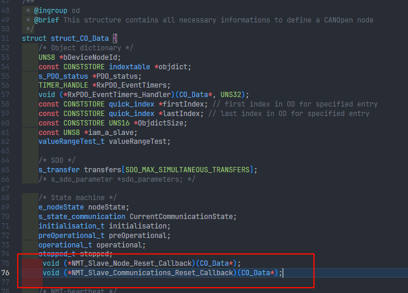

   

而且注意，复位节点应用层 的作用范围：如索引 `0x2000-0x9FFF` 的制造商特定参数

---

## SDO 协议

### 普通SDO 协议

下载协议download protocol：

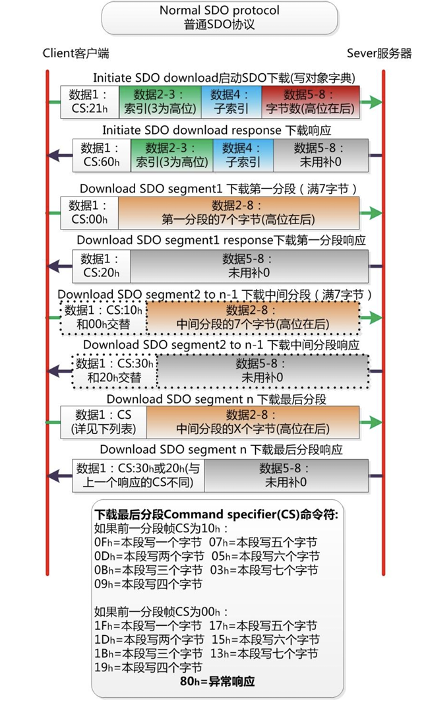

上传协议upload protocol：

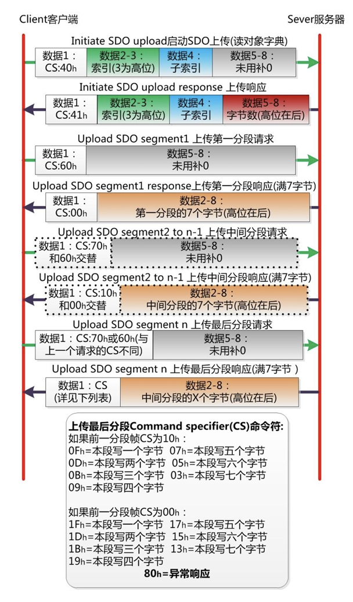

### 快速SDO

最常用最常见的SDO协议是快速SDO，所谓快速，就是1次来回就搞定。前提是读取 和写入的值不能大于32位。如图 8.3所示，为快速SDO协议的示意图。命令中直接包含了 要读写的索引、子索引、数据。可谓直接命中

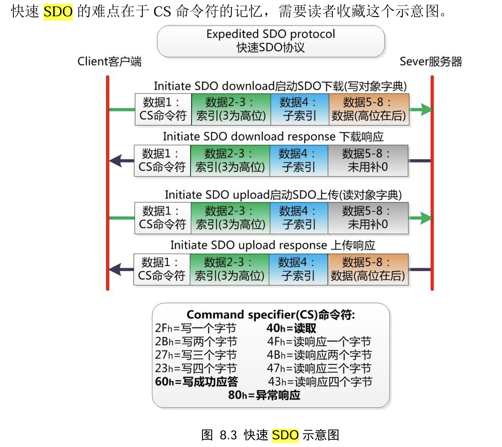

使用举例：

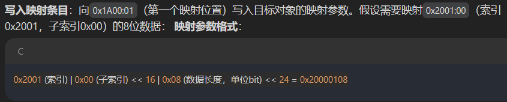

这条SDO 指令的意思是：向 TPDO Mapping 上 0x1A00 :01 位置上设置映射为 0x2001：00 ，且数据类型长度为8位

---

## 特殊协议（Special protocols)

### 同步协议（Sync protocol）

同步（SYNC），该报文对象主要实现整个网络的同步传输；

每个节点都以该报文作为PDO 触发参数，因此该同步报文的 COB- ID 具有较高的优先级 以及最短的传输时间；

### **多同步机制的需求**

在某些复杂系统中，不同设备可能需要**不同的同步频率**。例如：

- **高速设备**：需要每1个SYNC触发一次数据传输（如实时位置反馈）。
- **低速设备**：每2个SYNC触发一次数据传输（如温度传感器）。

此时需通过**PDO的传输类型和同步起始值**实现差异化配置。

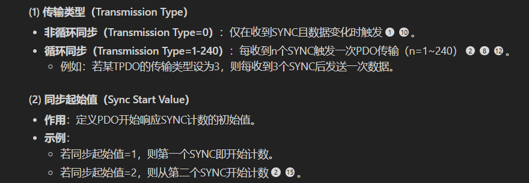

### 时间戳协议（Time - stamp protocol）

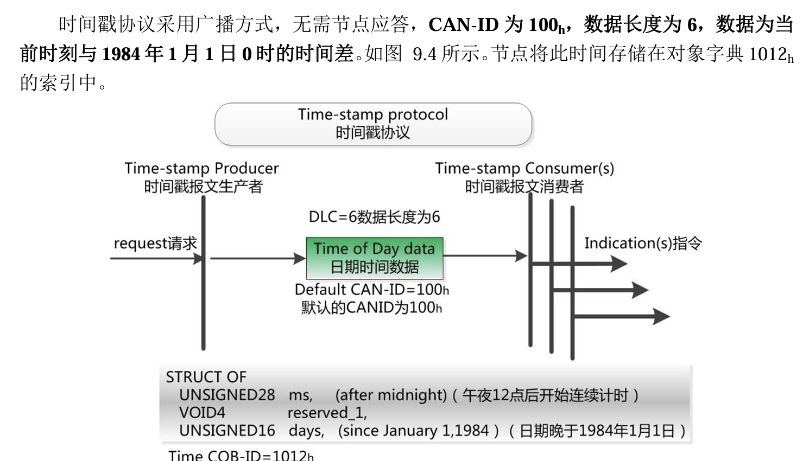

### 紧急报文协议（Emergency protocol）

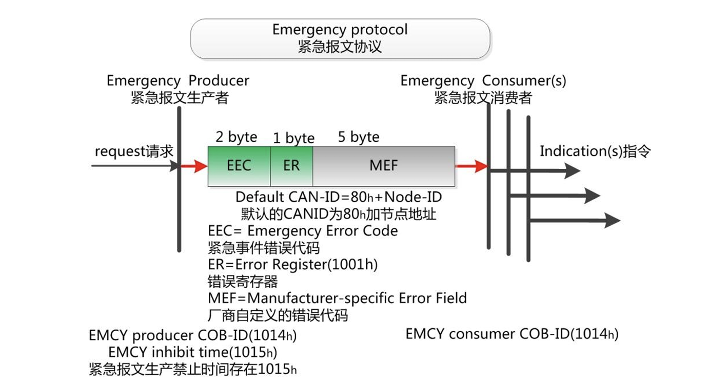


---

## canfestival 回调编写


---

### .od 文件的作用

Canfestival 提供Objdictionary 软件修改 .od 文件（对象字典文件）为.c 代码文件

也可以转换为 .eds ，PLC工程师将.eds 直接导入PLC控制器里，让PLC识别

.eds 现在有一个软件可以使用，可以打开其他商家的.eds


---

## cia402 协议

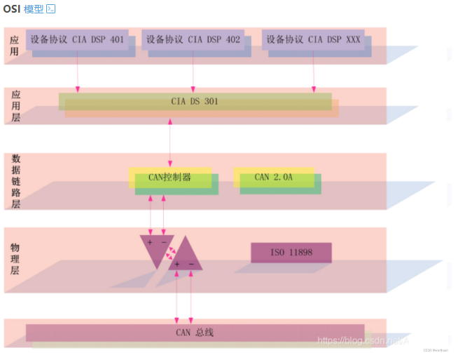

---

# 字典工具的使用

首先是：一定要一定要注意：CANFestival 源码必须和 其字典工具版本对应

否则新版本使用不了新的字典工具


---


---

# EtherCAT 通识

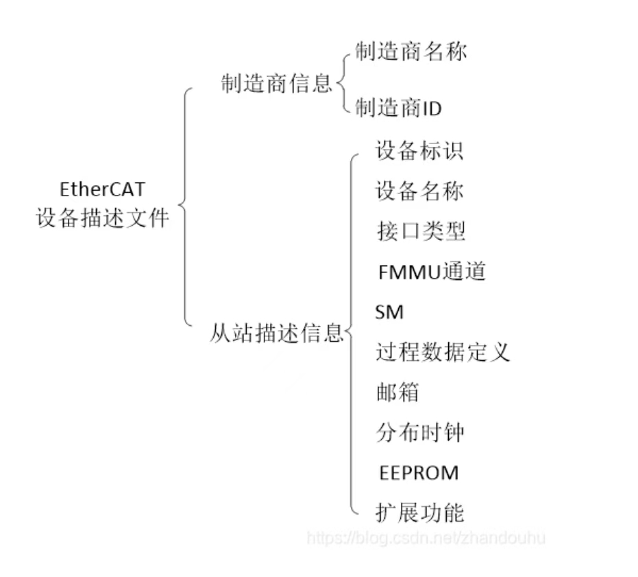

EtherCAT 从站设备**同时实现通信和控制应用两部分功能**，其中主要是四部分组成。这四部分是构成从站必不可少的因素，在标准 ISO/OSI 的七层参考模型中， EtherCAT 仅仅使用了物理层、链路层和应用层。


再说到 物理层和 链路层

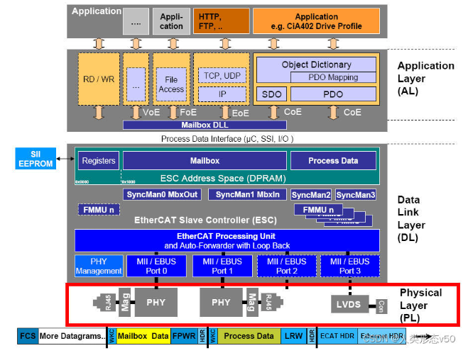

谈谈EtherCAT的设计一大优势点：分了一个物理层 和 链路层

即：链路层：采用“飞行中处理”机制，主站发送的以太网帧依次经过各从站，每个从站通过专用芯片ESC（EtherCAT Slave Controller）实时提取或插入数据，形成高效的环形通信结构

应用层：通过**邮箱协议**（Mailbox）和**过程数据通道**（PDO）实现多样化的通信需求，支持VoE、CoE、FoE、EoE等协议

也就是说 

EtherCAT做了一层， Mailbox 和 PDO ，然后通过这一层，在EtherCAT的应用层上可以 跑 CoE 、 FoE、EoE、VoE等


### ETG 标准

ETG标准其实只有两种：

- Class A： Basic --- PDO CoE FoE S2S Time-Distribution Data-Logger Frame-Logger
- Class B： Standard --- EoE SoE AoE VoE DC 

当然还有常提到的 Cable-Redundancy 线缆冗余、Hot Connect 热插拔 这些等标准非ETG规定

### Cable-Redundancy 线缆冗余

解决 线缆故障（从站具有两个网线口，可以在故障时自动进入回环模式

主站冗余：

- 通过交换机
- 同个硬件

### Hot Connect 热插拔

其实就是自动配置的问题

需求：应用程序 可根据从站配置自适应，无需重新人工配置网络和主站

## 做主站需要考虑什么因素？

- 开发成本、开发周期
- 开发难度
- 主站功能
- 平台选型
- 主站性能
- 应用定位

### 怎么评估主站性能？

- 长时间运行的稳定性
- Circle time 主站控制周期
- Circle time jitter 主站控制周期抖动
- 协议栈时间
- 算法时间 --- 应用算法的时间必须小于通讯周期

### 从站响应时间

主站发出一条EtherCAT报文，从站多久才会发生响应

## 什么是ESC?

从站控制器实现**链路层协议**：ESC负责处理EtherCAT数据帧，并使用双端口存储器实现EtherCAT主站与从站本地应用的数据交换；各个从站ESC 按照各自在环路上的物理位置 顺序移位读写数据帧；
在报文经过从站时，ESC从报文中提取发送给自己的输出命令数据并将其存储到内部存储区，该输入数据从内部存储区又被写到相应的子报文中；**数据的提取和插入都是由数据链路层==硬件==完成**

主要功能：

1) 集成数据帧转发处理单元，通信性能不受从站微处理器限制。**每个 ESC 最多可提供 8 个数据收发端口。**

2) **最大 8K 字节的双端口存储器 DPRAM 存储空间**，DPRAM 可以由外部微处理器并行或串行数据总线访问，这个访问的接口就是 PDI。

3) 具有 **FMMU** **逻辑地址映射功能，提高数据帧利用率。**

4) 由**存储同步管理器通道 SyncManager（SM**）管理 **DPRAM**，==保证数据的一致性与安全性==。

5) **集成分布式时钟 DC 功能，为微处理器提供高精度中断信号。**

6. **具有 EEPROM 访问功能**，存储 ESC 与应用配置参数，定义从站信息接口

## EEPROM 的定位（带电可擦可编程只读存储器）

ESC（EtherCAT Slave Controller） 用EEPROM 来存储所需要的设备相关信息，称为从站信息接口（SII，Slave Information Interface）；这里设计到一个关键的点：在使用新开发板的新EEPROM芯片，需要使用PC上位机 对 EEPROM 写入设备信息以及 PDI 接口方式，否则微处理处理器 无法对 ESC进行操作

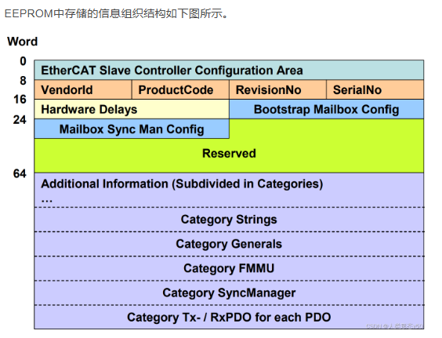

EEPROM使用**字地址**。需要注意的是，EEPROM存储数据使用的是小端字节序，即低地址存放低字节。

> 什么是 字地址？
>
> 字（Word）的定义：是处理器或存储器中一次操作的基本数据单元，其位数由硬件架构决定
>
> 16位系统：1字 = 2 字节
>
> 32位系统：1字 = 4字节
>
> ==**字地址**即为以字为单位的地址编号，每个地址指向一个完整的字（而非单个字节）==
>
> **示例**： 假设EEPROM总容量为1KB（1024字节）：
>
> - 按**字节地址**寻址：地址范围是`0x0000~0x03FF`。
> - 按**字地址**（16位字）寻址：地址范围是`0x0000~0x01FF`（每个字地址覆盖2字节）
>
> 小端字节序：（低位在前，高位在后）
>
> 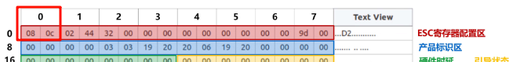
>
> 也就是说图中第一个字的数据应该是 0x0c08

对象字典：Object Dictionary 的作用

是EtherCAT 从站中所有可访问参数的结构化集合，类似于 CANopen 协议中的对象字典；

包含以下内容：

1. 索引（Index） 与 子索引（SubIndex）
   - 索引：16位地址（如`0x6000`），对应一个参数组或功能块
   - 子索引：8位地址（如`0x01`），用于细化索引内的具体参数

常见XML展示：

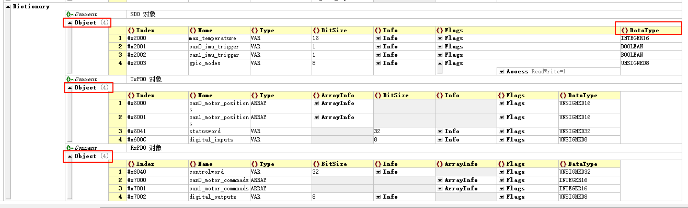

**直观可以看到SDO的主要定位：**

SDO 适合作为一些被读取的参数，像下面的 max_temperature 最大温度阈值、can0_imu_trigger、can1_imu_trigger、gpio_modes 就是只需要初始化那会读取一下的参数

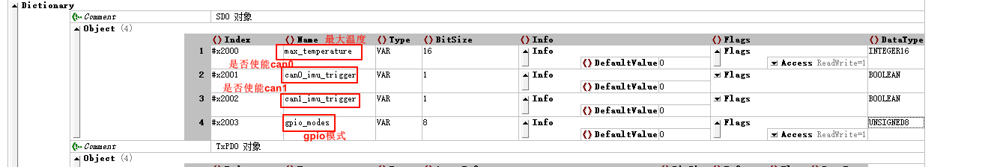

再看看PDO都设置了一些什么东西？


## 以太网PHY

以太网**PHY** （**Physical Layer** ，物理层芯片）是网络通信的核心硬件，负责将数字信号与物理介质（如网线、光纤）的模拟信号相互转换，确保数据可靠传输。

核心功能：

- 信号转换：
  - **发送**：将MAC层的数字信号转换为适合线缆/光纤传输的模拟信号（如差分电压、光脉冲）。
  - **接收**：将物理介质的模拟信号还原为数字信号，供MAC层处理。
- 编码与解码：
  - 使用 **8B/10B**（千兆以太网）、**64B/66B**（万兆）等编码，平衡数据流中的0/1比例，确保时钟同步。
- 链路管理：
  - 自动协商（Auto-Negotiation）：与对端设备协商速率（10M/100M/1G等）和双工模式（全双工/半双工）。
  - 冲突检测（CSMA/CD）：在半双工模式下检测信号冲突并重传。
- 状态监测：
  - 实时检测链路状态（连接/断开）、误码率、信号强度，通过LED或寄存器反馈。


###  **与MAC的协作**

- 接口类型：
  - **MII**（媒体独立接口）：4位数据线，支持10M/100M。
  - **GMII/RGMII**：千兆以太网，数据位宽缩减（RGMII为4位，时钟优化）。
  - **SGMII**：串行接口，减少引脚数量，适合高密度PCB设计。
- 协作流程：
  1. MAC层生成数据帧，通过MII/GMII接口发送至PHY。
  2. PHY编码并转换为模拟信号，驱动物理介质传输。
  3. 接收端PHY解码信号，通过接口回传至MAC层。

---

## EtherCAT XML 框架

每个 EtherCAT从站设备都需要一个硬件描述 XML文件，用来给主站组态

XML文件中描述定义了 通信时 需要用到的各种数据

包括设备所属公司名，设备名，设备版本，LOGO等基础信息；

最主要的包括了通信时点位、大小、数量等

XML文件是设备描述文件，烧写在 EEPROM里面，LAN9253上电后，会从 EEPROM中 加载配置参数，完成启动初始化过程

主站设备扫描从站时，会读取EEPROM描述信息，完成对从站的初始配置

在 EtherCAT 中，**EDS** 被特指为从站的设备描述文件 **ESI**（EtherCAT Slave Information），用来描述从站配置信息，并采用 XML 文件格式

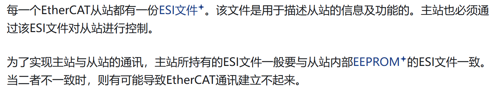

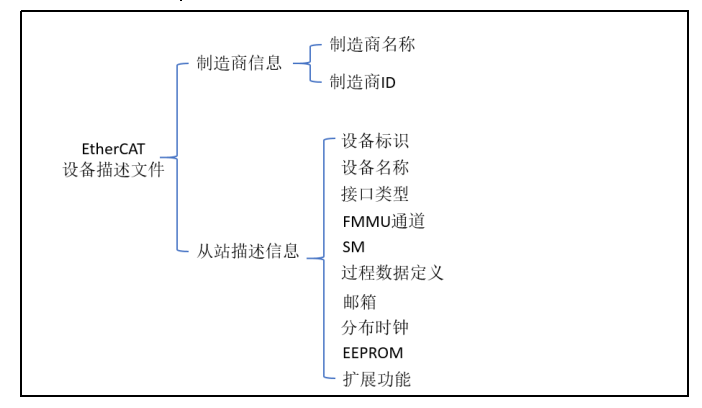

接下来，将详细解析如何进行EtherCAT ESI 文件的配置

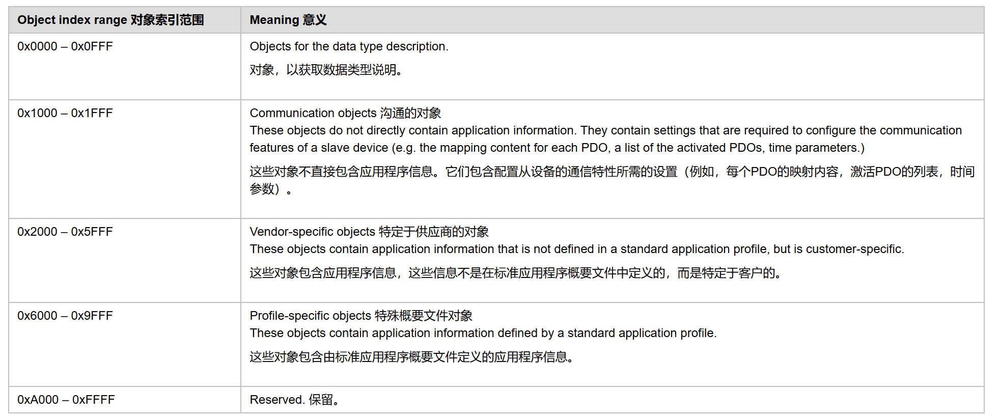

### **周期性数据（Process Data）**

由于EtherCAT一般采用COE协议对从站进行周期性数据的交换。所以如不特殊说明，一般讲EtherCAT通讯的周期数据，都是指**PDO**。主站通过与从站交互PDO数据从而实现对从站设备的实时控制。

### 非周期性数据（Mailbox）

同理，非周期数据一般就指代SDO

### SyncManager

SyncManager用于保证主站与从站之间数据交换的一致性和安全性，并在数据发生改变时，使用中断通知主从站双方

SyncManager 分别支持 Buffered Mode 和 Mailbox Mode 两种方式的通讯

- Buffered Mode ：缓存模式，是SyncManager 提供的一种可以同时读取 和 写入而不相互影响的模式（3-buffer-mode）此种模式主要用于EtherCAT总线的周期性数据**Process Data**，简单理解即PDO。
- Mailbox Mode：是一种只能允许交替读写缓存的模式。缓存器同一时间只能缓存区进行一次读或者写的操作，只有写入操作完成，才可以进行读取；主要用于EtherCAT总线的非周期性数据**MailBox**，即SDO

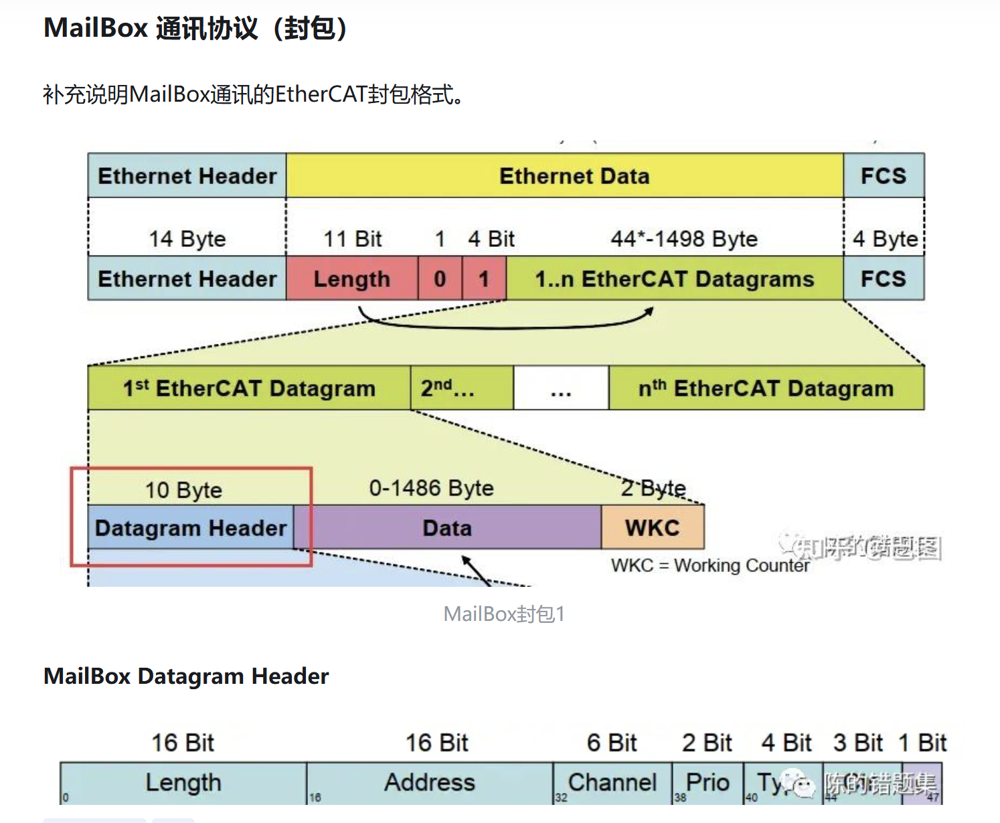

一般使用的都是 COE （CANopen over EtherCAT），其实就是EtherCAT对CANopen协议相应的功能补充

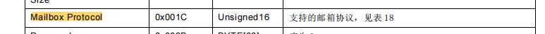

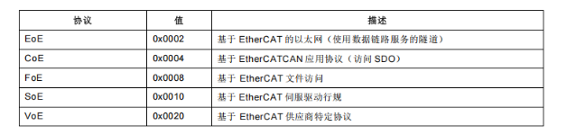

使用 EEPROM Generator 时，并没有勾选CoE的选项，也就是说已经默认选上CoE了

### 对象字典结构

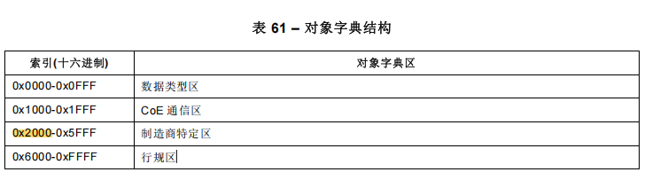

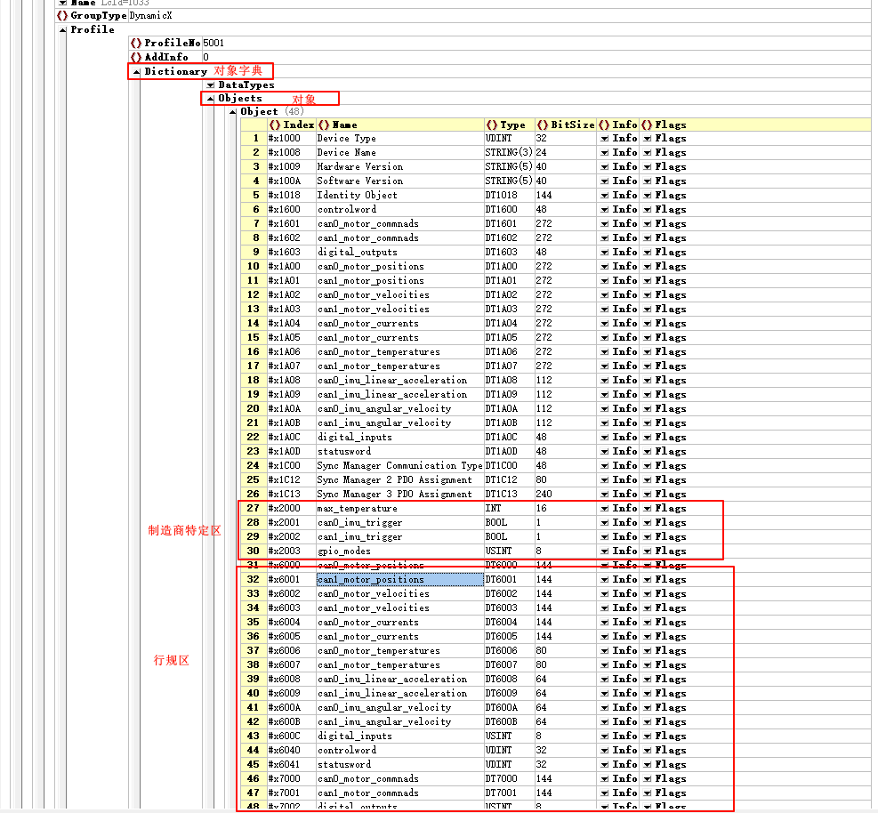


---

## SM （Sync Manager）同步管理器

功能与作用：

- **数据一致性保障**：SM通过管理双端口内存（DPRAM），确保主站和从站应用层之间的数据交换安全一致，避免同时读写冲突
- **通信模式支持**：
  - 缓冲模式（Buffered Mode）：适用于周期性过程数据（如电机控制），允许主站和从站随时访问缓冲区，最新数据覆盖旧数据
  - **邮箱模式（Mailbox Mode）**：用于非周期性通信（如参数配置），通过握手机制确保数据完整，避免丢失
  - **中断生成**：SM通过中断通知主站或从站数据更新，减少轮询开销

SM同样属于**数据链路层**，是主站与从站应用层数据交换的同步中枢。例如，SM0通常配置为主站输出邮箱（命令通道），SM1为输入邮箱（响应通道），SM2/SM3用于过程数据缓冲区

---

## 为什么要使用EtherCAT？（优势）

现在的以太网通信模型大致是以下：

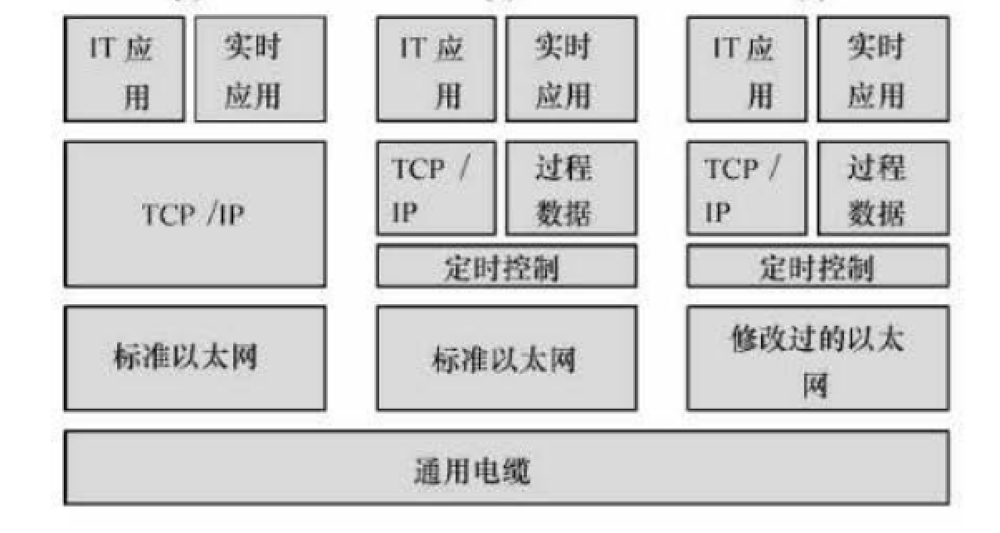

### 报文特点

EtherCAT使用的报文和 EtherNet 是完全一样的，尽管EtherCAT采用的是自有协议，但它的物理层与以太网非常类似（EtherType）

那为什么不直接使用EtherNet？

- 带宽利用率低（最小以太网帧长度：82字节， 4/82 = 4.87% 的应用帧利用率
- 协议栈大小和延时
- 交换机引入的延时

比较EtherCAT 和 实时以太网（基于交换机）

优点：

- 高带宽：帧应用数据利用率提高到 90% 以上
- 精确同步：高性能EtherCAT协议可在数据传输时实现可预测时序和精确同步（<= 1us)
- 灵活拓补：支持线形、环形、星形 和 树形拓补，且无需外部以太网交换机、集线器和路由器
- 工作计数器：EtherCAT 帧的最后两个字节，指示每个从站的 读/写 操作是否成功

### 报文结构

EtherCAT的以太网帧类型为0x88A4；

EtherCAT头包括三个部分：**EtherCAT数据长度**、**保留位**、**类型**

- 数据长度为所有子报文长度的总和
- 类型固定为1（表示和EtherCAT从站通讯）

EtherCAT的子报文包括3个部分

- 子报文头
- 数据
- 工作计数器（WC）

补充：载荷结构不同；以太网帧的标准结构包括：

- 目的 MAC
- 源 MAC
- EtherType
- 数据载荷
-  FCS

EtherCAT特殊处：专门的EtherType0x88A4，并且在数据载荷部分并不是简单的数据，而是一系列EtherCAT数据报

并且在普通Ethernet中，载荷部分通常是完整的协议数据单元，如IP数据报等

在EtherCAT中，载荷部分被分成一个个 EtherCAT 数据报，每个数据报由 EtherCAT 自己的协议头和数据组成，且支持多数据报封装在同一帧内

## EtherCAT 从站软件架构

每个EtherCAT 节点 必须和 ESI（EtherCAT Slave Information） 文件配合一起

主站通过读到的ESI 文件与标准定义对比，才能识别从站

单个ESI文件可以包括多个从站节点的信息

### EtherCAT寻址方式：

顺序寻址：自动增量寻址

设置寻址：固定寻址

逻辑寻址：前面介绍的顺序寻址 和 设置寻址并不常用；在逻辑寻址模式下，整个32位地址空间 都将作为地址值；整个网段内有 4GB 的地址空间可以被寻址

而且逻辑寻址的优势是搭配FMMU

主站不会说一定按照拓补结构来进行从站的编号，而是说以一种随机的编码对从机地址进行分配，然后搭配FMMU内存管理 单元来进行寻址（地址的匹配等等工作），这其实是一种对主站管理负担的减轻

### FMMU （Fieldbus Memory Management Unit）现场总线存储器管理单元

功能与作用：

- 逻辑到物理地址映射：FMMU**负责将主站定义的逻辑地址 转换为 从站的物理地址**，支持跨多个从站的逻辑寻址；例如，主站可以通过一个逻辑地址访问分布在多个从站中的物理内存区域
- 数据分段处理：通过配置FMMU通道，主站可实现对从站内存的连续 或 逐位访问，支持读、写或读写混合操作
- 高效数据报处理：在报文传输过程中，FMMU允许从站“动态处理”数据

FMMU属于**数据链路层**的一部分，位于EtherCAT从站控制器（ESC）中，是主站配置从站的关键环节。主站通过FMMU配置逻辑地址与从站物理存储的映射关系，从而实现高效的过程数据通信

95%的应用，3个FMMU 已经可以满足需求

​	MBoxState , Outputs , Inputs

仅存在于 从站，从而消除了 主站中的存储器 管理负担，通常用于 将过程数据映射到主站

## EtherCAT：SyncManager 以及通信模式

- SyncManager 用于管理DPRAM ，以确保主站和从站之间的数据一致，它是主站和从站交换数据的内存管理单元

- 两种模式：邮箱 或 缓存

  - 缓存通常用于**应用中的过程数据交换**，它是三缓存模式

    3个缓冲区可保证数据传输保持一致以及访问最新数据

    数据可随时写入

    始终提供数据缓冲区，以供随时读取

    用于主站 和 从站之间的 过程数据交换

  - 邮箱通常用于**非过程数据通信**，比如<u>配置数据，它是单缓存模式</u>

    邮箱通讯是可选的，但是强烈推荐使用

    通信是全双工的，即从站可以主动发起一次通信，有两个Sync Manager ；

    Sync Manager 0 ： 主站到从站

    Sync Manager 1 ： 从站到主站

    在早期的通信过程中就可以采用邮箱进行通信了，比如 Pre - Operational 

    由于是单缓存模式， 必须在写入新数据前 读取数据

- 最多有16个独立的SyncManager 通道

- 配置SyncManager 的寄存器从 0x0800 开始

### PDI （Process Data Interface）

是连接  从站控制器（ESC） 与 从站微处理器（MCU）的通信接口；负责主站与从站之间的实时数据交换

PDI的设计直接影响从站的性能和数据传输效率

大多数[EtherCAT](https://zhida.zhihu.com/search?content_id=187187675&content_type=Article&match_order=1&q=EtherCAT&zhida_source=entity)从站设计从站微处理器芯片是普通单片机，数据传输是通过SPI串行接口进行的，传输效率比较低，这就导致EtherCAT通信协议卓越的性能无法得到充分的发挥

在MCU 与 LAN9252 的通信中，可利用PS端的引脚设计**FSMC模块** 进行并行传输数据，极大地提高了数据传输速率

FSMC技术主要有如下特点：

\1) 有多种可扩展的存储器型号；

\2) 可以同时扩展多种外部存储器；

\3) 可以对外部存储器进行快速读写；

\4) 易于扩展多种外部存储器；

\5) 易于实现多种存储操作

> 扩展：HBI变址寻址模式
>
> HBI（Host Bus Interface）：并行总线接口
>
> 核心目的：解决传统串行接口（如SPI）带宽不足的问题
>
> 这种设计通过并行总线（如FSMC）替代传统SPI，大幅提升吞吐量，尤其适合需要高实时性的工业控制场景


### EtherCAT： 工作计数器（Working Counter）

- EtherCAT 数据报文以 16位 工作计数器（WC ）结束

- 如果命令成功（Read = +1 Write = +2 Read/Write = +3），从站将以硬件方式使WC 递增
- 主站通过将 WC 与 预期值进行比较来检查 EtherCAT 数据报是否得到有效处理

WcState：EtherCAT 诊断

WcState = 0 在上一个周期成功进行了通信

WcState = 1 无效的通信 

### EtherCAT ：状态机

包括 ：

- 初始化（Init）主站通过EEPROM里的配置信息对从站的相关寄存器进行配置和初始化，无法进行数据交换
- 预运行（Pre-OP）EtherCAT协议可以进行邮箱数据的通讯，主站通过邮箱数据将一些初始化数据发送给从站，但是不能进行过程数据的传输
- 安全运行（Safe-OP）主站通过对从站的现场管理单元和SM通道的设置，可以发送过程数据给从站，但是从站无法发送过程数据给主站
- 运行状态（OP）主站和从站可以进行完整的数据通讯

在从站进行状态机转换时，从站首先检查状态机对应的SM通道是否配置正确，检查的内容有SM通道大小、SM通道是否重叠、SM通道起始地址是否为偶数以及SM通道是否被使能；如果SM通道配置没有问题，则通过应用层状态设置函数设置成为相应的状态；

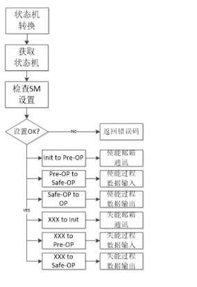


### 分布式时钟

一般低速要求场景可能不需要配置这个分布式时钟，但如果真想要达到EtherCAT的性能，利用其极短的同步时间，就必须配置使用分布式时钟

（这些从站都是DC同步的，但并不是所有的从汉都需要DC同步）

由于每个设备的本地时钟是自由运行的，为了使所有设备进行同步，需要利用分布时钟进行同步

分布时钟同步的原理是 将所有的从站设备 都同步于 参考时钟，EtherCAT 将主站连接的第一个且具有分布时钟功能的从站作为参考时钟；

EtherCAT网络上电初始化时，会对分布时钟进行初始化，通过测量计算出各从站设备时钟与参考时间的偏移，然后对从站设备时钟进行校正，从而达到时钟同步的目的

EtherCAT分布时钟基于硬件校正，准确性高！

### EtherCAT 从站同步方式

- 自由运行（Free Run）--- 没有同步
  - EtherCAT 从站基于 自己的时钟进行工作
  - 从站没有和EtherCAT
- SM ，与SyncManager 输入输出事件同步 --- 有jitter的同步
  - EtherCAT 从站 与 SM2 事件（周期性输出） 或者SM3 事件（周期性输入）
  - SM2/SM3 事件是在处理帧的过程中，由SyncManager触发的
- 分布式时钟（DC），与SYNC事件同步 --- 精确的同步
  - EtherCAT 从站与 DC时钟系统的 SYNC0/SYNC1 事件同步
  - 需要在主站进行补偿处理

## 深入解读EtherCAT时钟DC同步的三种模式

EtherCAT系统中从站同步中的一些时间误差来源和补偿方法，主要可以归纳为以下几点：

- 当主站向所有从站传送数据（具体存放到从站DPRAM中，例如SM2）时，由于EtherCAT总线是串行传输，所以不同从站接收到数据的时刻会有差异（误差1），这是一种天然的延迟现象。
- 同时，主站每次发包的时间间隔本身也存在一定偏差（误差2），但这种偏差对各个从站来说是相同的。
- 由于这两种原因，如果单靠提高实时性，也只能实现微秒(us)级的同步精度。

```
shift time(0x1C32/33:03)、
Calc and copy time(0x1C32/33:06)、
Delay time(0x1C32/33:09)。
```

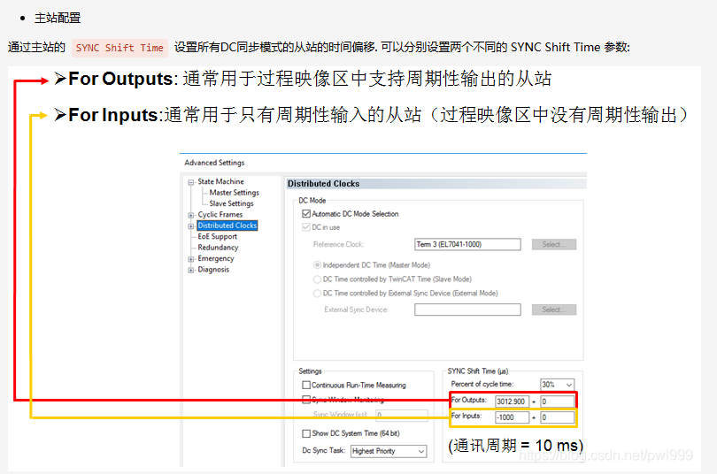

TwinCAT提供了两种配置选项，一种用于配置输入同步（input SYNC0），另一种用于配置输出同步（Output SYNC0）；但实际上在EtherCAT协议中，只会有一个同步信号SYNC0，也就是网络中所有从站都使用同一个参考同步信号

为了实现更准确的同步，从站会在硬件上增加一个延迟补偿时间：

1. 输出有效时间（Output Valid）是由SYNC0信号加上从站配置的输出延时（Output Shift Time）得到的，表示从站何时真正将处理好的数据输出到硬件。
2. 输入锁存时间（Input Latch）则是由SYNC0信号加上从站配置的输入延时（Input Shift Time）得到的，表示从站何时将外部信号或测量结果锁存到内部数据存储（DPRAM）中。

通过这两项补偿，虽然EtherCAT只有一个同步信号，输出和输入可以分别调整自己的有效时刻，从而补偿硬件上固有的延迟差异，实现更精确的一致同步。

用EtherCAT的分布式时钟(DC)功能使从站设备同步指的是，总线中的第一个DC从站被定义为基准时钟，EtherCAT主站将基准时钟的时间分配至所有的从站

因此，EtherCAT主站周期性发送一个ARMW命令，以此读取存储在时钟主站的ESC（EtherCAT从站控制器）上适当的寄存器中的总线时间，并将这个值写入DC-从站相应的寄存器中

这些DC从站通过整合在ESC中的一个控制器来更新他们的本地时间。为保证请求的精度（可以接收低于1us的值），特殊从站之间的EtherCAT帧延迟必须得到额外的补偿。

> 控制器，就是根据偏移时间来调节自己时间加加的速度

### Free Run （非同步）


### SM-Synchronous

从站的 过程数据处理，由接收到携带过程数据的周期性数据帧时 所产生的 硬件中断触发


### DC-Synchronous

从站的过程数据处理，由基于分布时钟和系统时间的硬件中断触发


---

## 0x1C32/33 对象字

从站通过标准的COE对象0x1C32 和 0x1C33 来描述内部时序，其中0x1C32描述Output，0x1C33描述Input

请注意**0x1C32/33是一个`CoE对象`，而不是一个寄存器**，每个对象包含0x20个寄存器

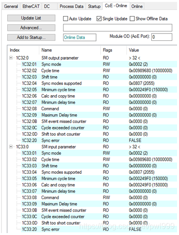

==EtherCAT从站的参数保存在E2PROM中，而供外部访问的参数则封装成CanOpen对象字的形式==

通过参数0x1C32 和 0x1C33的不同组合，可以确定分布时钟的工作模式，组合方式如下

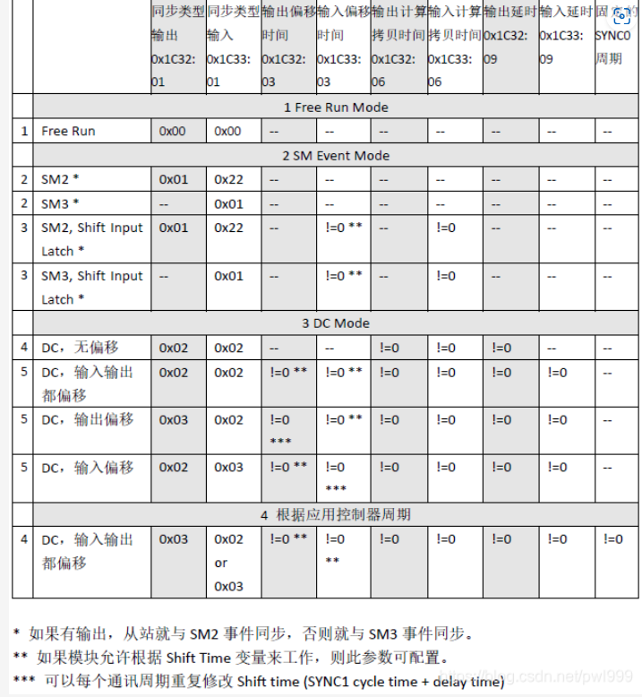

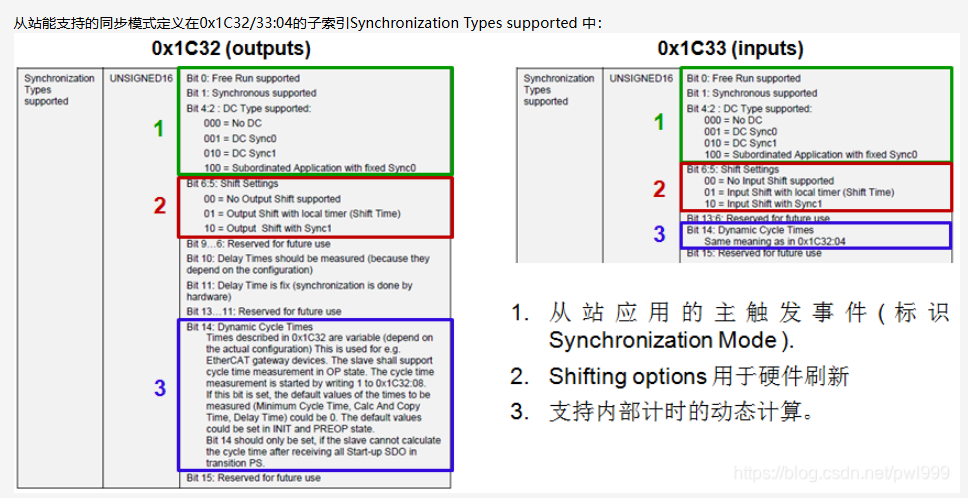

如果为了确保主站通讯周期大于所有从站的最小循环周期，不得不严重限制某些DC及非DC从站的通讯周期，以至于需要快速响应的任务不能执行，==建议使用周期不同的多个任务，并把每个从站链接到适当周期的任务==

## 输入/输出 偏移时间 （Output / input shift time）

从站可以选择支持硬件刷新（ `Output Valid` and/or `Input Latch` ）的软件偏移时间（Shift Time）。如果这个SubIndex可写，主站/用户就可以在从站周期的范围内对硬件刷新事件（`Output Valid` and/or `Input Latch`）的触发时间进行微调。

如果在slave Advanced Settings 中使用默认设置的 “Based on Input Reference”标记，主站在对从站进行初始化时就会使用 SYNC Shift Time 作为输入的同步偏移时间 … 否则就使用SYNC Shift Time 作为输出的同步偏移时间

简单来说：从站中的Shift Time数值反映了它与主站参考设置之间的偏移关系，而且大部分从站的DC参数都是预先设定好的（在ESI中定义），用于确保整个系统能正确同步，用户不应随意更改。

## Delay time

Delay Time 指的是从站硬件在接收到同步信号（Sync0）后，完成状态转换或者数据采集所需要的实际延迟时间。换句话说：

- 对于输出，Delay Time 是从站硬件从接收到同步信号到真正切换输出状态所需的时间。
- 对于输入，Delay Time 是硬件采集现有状态所需时间

在DC分布式时钟同步过程中，Shift Time（偏移时间）扣除掉Delay Time后，得到的净延时用于精确控制何时启动输出动作（或输入锁存），以便不同从站能在物理上实现严格同步。这些Delay Time参数通常在从站的ESI文件中已经预置，由制造商根据硬件特性确定，用户一般不需要修改

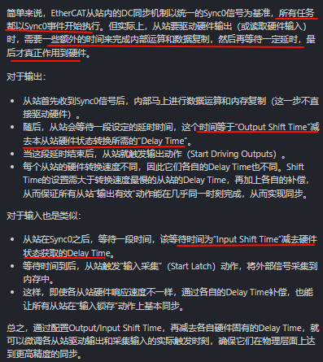

总结一下：就是SYNC信号就算同时到达各个从站也没用，因为他们都存在不一样的硬件延迟delay_time，也就是说SYNC直接触发让他们都开始响应是不够的，因为并不能保证它们都同时输出，所以使用这种机制：

收到SYNC之后，都做延迟，这段延迟等于各自的shift time - delaytime，然后所有从站都同时触发，这样来实现同时输出与输入


---

探花：generator

### 1. 勾选 “Enable PDO Assign”、“Enable PDO Configuration”

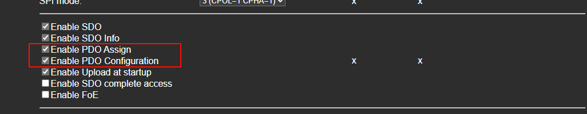

效果：

- **PDO Assign 启用**：允许主站通过 SDO 写入操作来修改 PDO 的映射分配，也就是决定哪些对象（及其子索引）参与实时数据传输。启用后可以动态调整设备的数据传输配置。
- **PDO Configuration 启用**：在允许分配的基础上，还可以对 PDO 的具体参数（例如数据长度、数据类型等）进行更详细的设置。启用后，设备可以支持更复杂的映射和配置细节修改。

没有启用时：设备将只能使用出厂默认的PDO映射配置，主站无法通过SDO动态地改变或优化数据传输映射；

生成的文件只有.hex 和 .json 和 .xml 有区别

.h 和 .c 都没有区别

### 2. 


