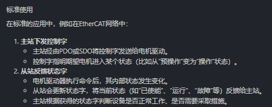
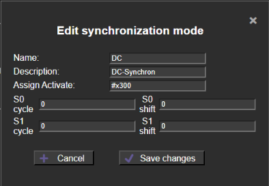
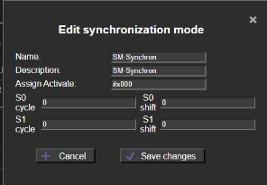

规划一下对象字典

### TPDO

需要发送电机的信息

### RPDO

需要接收控制命令

### SDO

电机最大温度（过热保护）

电机最大速度（）

电机的limit限制等等

### 状态字 & 控制字

### 控制字（Control Word）

- **作用**：由主站写入，从站（例如电机驱动器）根据控制字中的各个位设定相应操作或状态转变。
- **内容**：控制字里包含启动、停机、复位、启用等命令与状态转换要求。它是主站下发给电机的指令，要求电机转换到预定状态（如从预操作到安全操作或到操作状态）。
- **应用实例**：在电机驱动控制中，主站先下发一个特定的控制字（例如“使能电机”、“启动驱动”等），驱动器在接收并执行后，其状态字就会反映出相应的响应。

### 状态字（Status Word）

- **作用**：由从站反馈给主站，表示电机或设备当前的实际运行状态与异常情况。
- **内容**：状态字通常是一个位域，其中的各个位标识电机是否准备就绪、是否处于故障、是否已激活、是否在运行等。状态字帮助主站判断电机的运行情况和是否正确接收控制指令。
- **应用实例**：电机在完成状态转换或执行命令后，会通过状态字反馈，如确认“已启动”、“故障”、“准备就绪”等，这些反馈有助于主站进行进一步控制或故障处理

状态字？

一路上最多只挂 6个电机，但是可以设计为 8个

然后用一个八位的无符号数，置一表示电机使能，置0表示电机失能

## go1电机控制板 & VESC电机 从站控制板

额外可以加个GPIO外设

从站也可以返回GPIO状态

### 一定要在从站的xml中声明自己可以进行sm同步

