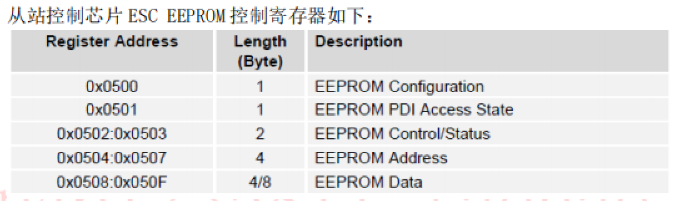

# 1. 官网tutorials

## General

soem库提供了一些应用程序供用户来发送与接收EtherCAT帧，这通常包括：

- 读取和写入SOEM 的TxPDO/RxPDO
- 保持本地IO 数据 和 全局IO 映射同步
- 检测SOEM报告的错误
- 管理SOEM报告的错误

# 2. 源码解析

## 2.1 EEPROM访问

步骤：

1. 读取EEPROM控制/状态寄存器 0x0502：0x0503的内容，确认EEPROM没有处于Busy状态
2. 
