*记录一下阅读源码 和 EtherCAT原理到代码的实现部分*

# 1. 核心数据结构

一种写法：

```c++
#define CC_PACKED_BEGIN
#define CC_PACKED_END
#define CC_PACKED       __attribute__((packed))
#define CC_ALIGNED(n)   __attribute__((aligned (n)))
```

**CC_PACKED_BEGIN / CC_PACKED_END**
这两个宏通常用作标记结构体起止，以便在其他编译器或平台上插入对应的对齐指令。这里它们被定义为空，仅作可读性或兼容性占位

1. **CC_PACKED**
   展开后是「**attribute**((packed))」，告诉编译器对结构体内成员不进行额外字节对齐或填充，以最紧密（1字节）方式对齐。
2. **CC_ALIGNED(n)**
   展开后是「**attribute**((aligned (n)))」，明确指定结构或变量的对齐边界为 n 字节。这样能够在某些硬件架构上获得更优化的访问性能或满足特定对齐需求


---

邮箱状态：

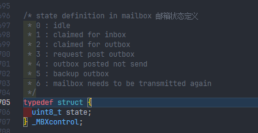


---


ecat_slv.c 中

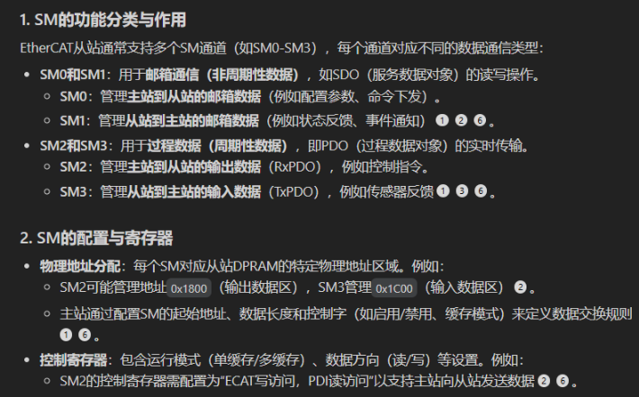

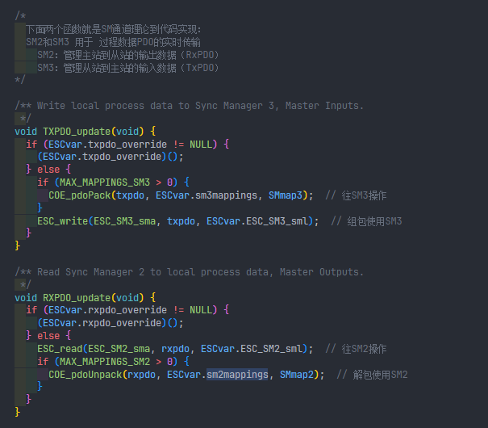

---

代码重写的思路：

读取ethercat 输入 和 ethercat 输出

通过源码来看：

```c

void DIG_process(uint8_t flags) {
  /* Handle watchdog 看门狗执行逻辑 */
  if ((flags & DIG_PROCESS_WD_FLAG) > 0) {
    if (CC_ATOMIC_GET(watchdog) > 0) {
      CC_ATOMIC_SUB(watchdog, 1);
    }

    if ((CC_ATOMIC_GET(watchdog) <= 0) && ((CC_ATOMIC_GET(ESCvar.App.state) & APPSTATE_OUTPUT) > 0) &&
        (ESCvar.ESC_SM2_sml > 0)) {
      DPRINT("DIG_process watchdog expired\n");
      ESC_ALstatusgotoerror((ESCsafeop | ESCerror), ALERR_WATCHDOG);
    } else if (((CC_ATOMIC_GET(ESCvar.App.state) & APPSTATE_OUTPUT) == 0)) {
      CC_ATOMIC_SET(watchdog, ESCvar.watchdogcnt);
    }
  }

  /* Handle Outputs 读取ethercat输出 */
  if ((flags & DIG_PROCESS_OUTPUTS_FLAG) > 0) {
    if (((CC_ATOMIC_GET(ESCvar.App.state) & APPSTATE_OUTPUT) > 0) && (ESCvar.ALevent & ESCREG_ALEVENT_SM2)) {
      RXPDO_update();
      CC_ATOMIC_SET(watchdog, ESCvar.watchdogcnt);
      /* Set outputs */
      cb_set_outputs();
    } else if (ESCvar.ALevent & ESCREG_ALEVENT_SM2) {
      ESC_read(ESC_SM2_sma, rxpdo, ESCvar.ESC_SM2_sml);
    }
  }

  /* Call application   */
  if ((flags & DIG_PROCESS_APP_HOOK_FLAG) > 0) {
    /* Call application callback if set */
    if (ESCvar.application_hook != NULL) {
      (ESCvar.application_hook)();
    }
  }

  /* Handle Inputs 处理从站的TxPDO，准备好向EtherCAT上发送 */
  if ((flags & DIG_PROCESS_INPUTS_FLAG) > 0) {
    if (CC_ATOMIC_GET(ESCvar.App.state) > 0) {
      /* Update inputs */
      cb_get_inputs();  // 更新将要发送的数据
      TXPDO_update();
    }
  }
}
```

可以看到他们调用的接口分别是：

读取ethercat输出：

```c
RXPDO_update();
...
cb_set_outputs();
```


---

在看 esc.h 时，有疑惑：

在esc_cfg 结构体的定义中有这个：

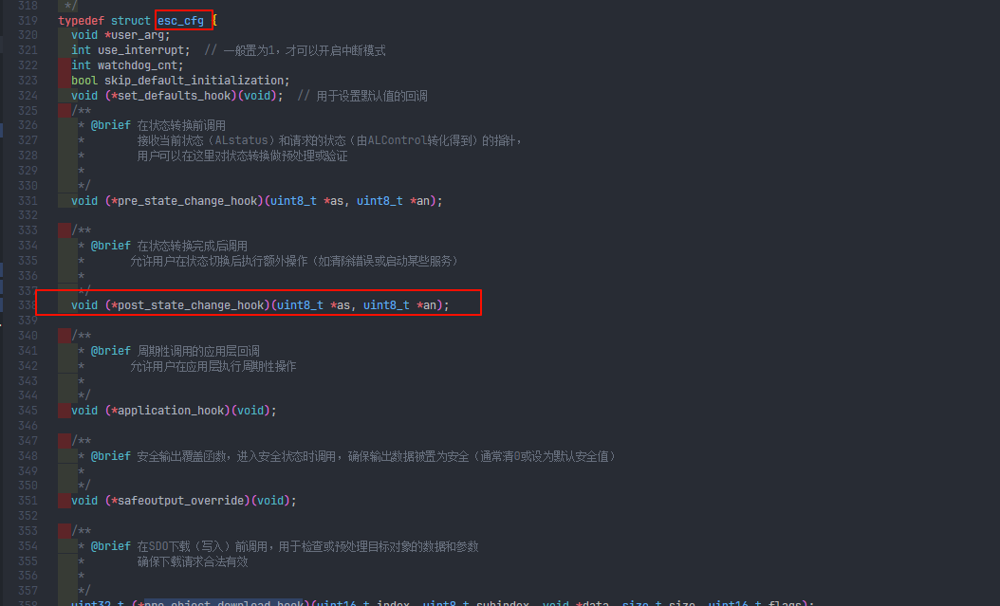

然后在_ESCvar 的定义中发现了：

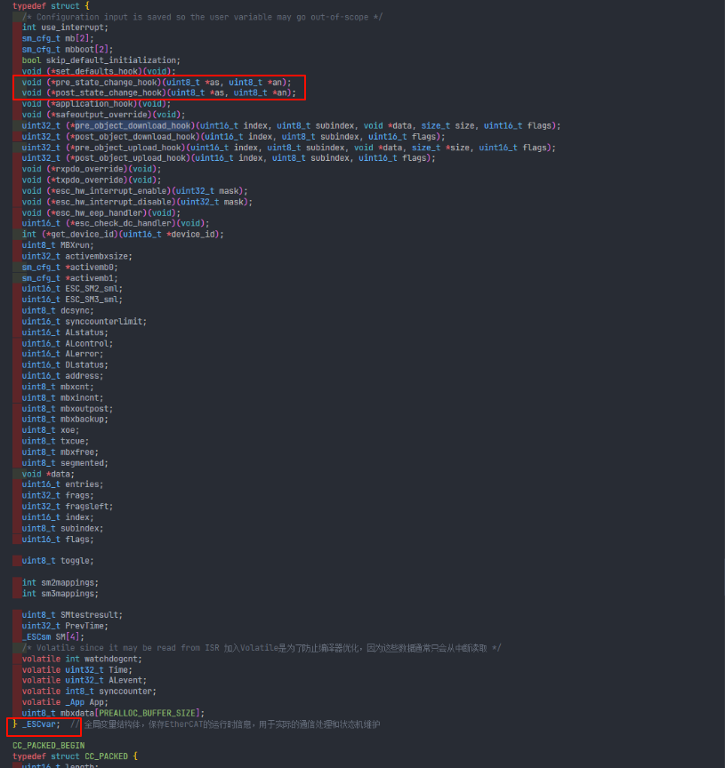

也就是说，明明有一个esc_cfg结构体，但是它的一些东西在一些 所谓的命名前带一 ’_ ‘ 作为前缀的数据结构中也定义了

第一：命名规范，类似于私有成员，命名前带一横杠表示这个结构其实是库源码中的私有成员，也就是说，是不需要用户所干预的；当然也会发现，我们只是需要实例化一个结构体：esc_cfg，其他都不用

第二：怎么数据共享？我们只对esc_cfg做了赋值初始化，不对那些：`_ESCvar `、 `_MBXh` 等私有成员做初始化，那不是跟没有一样吗？

其实，肯定在系统给的初始化函数中，肯定会有“拷贝函数”

证明如下（

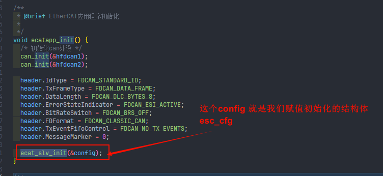

在进一步：


进一步进入函数，可以看到：

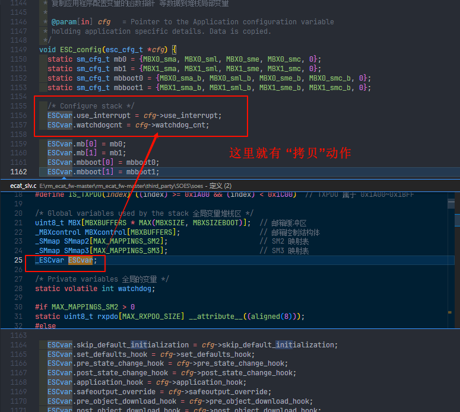


---

使用方法（官网文档阅读）：

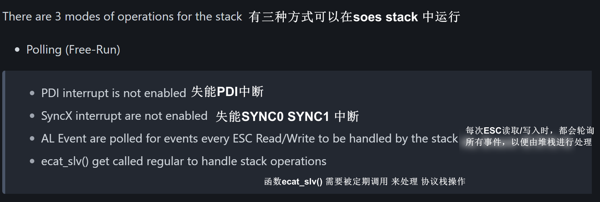

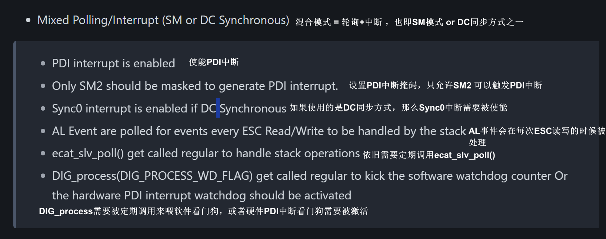


看看这个函数的实现方式：

```c

```

怎么设置掩码，实际上，这需要查看数据手册：


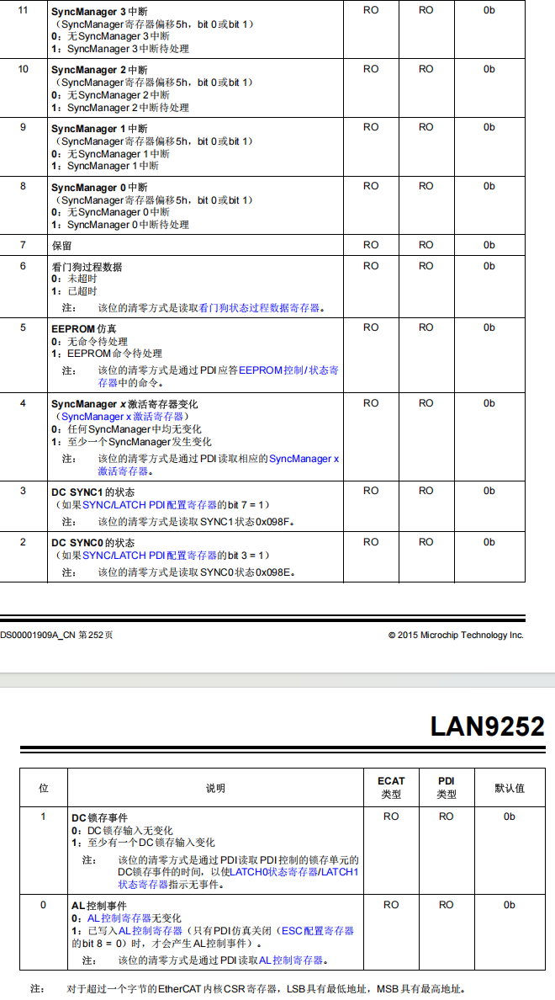

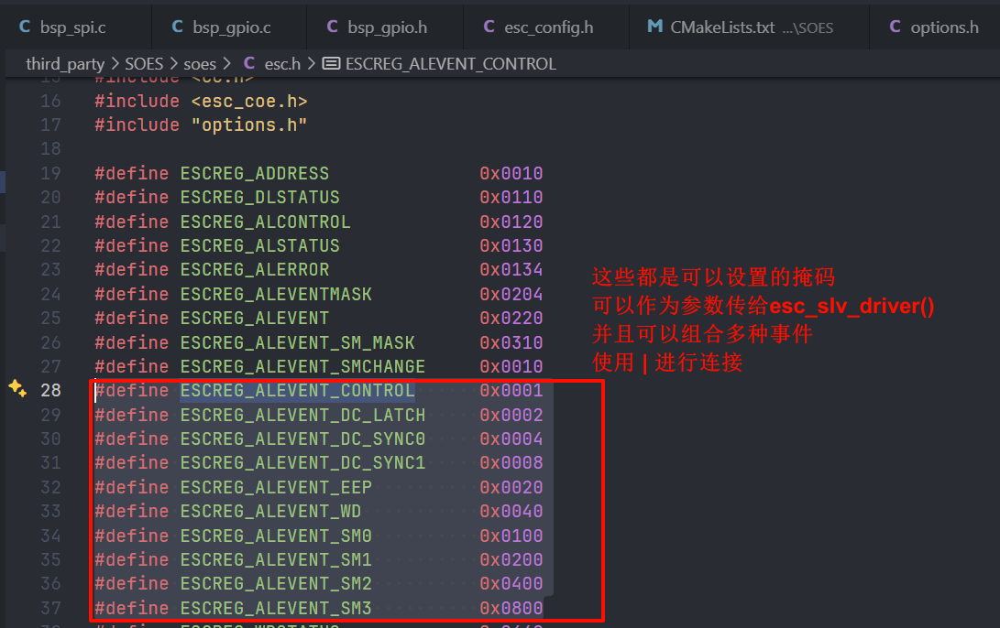

（更正为 `esc_slv_worker()`）

```c
void ecat_slv_worker (uint32_t event_mask)
{
   do
   {
      /* Check the state machine */
      ESC_state();
      /* Check the SM activation event */
      ESC_sm_act_event();

      /* Check mailboxes */
      while ((ESC_mbxprocess() > 0) || (ESCvar.txcue > 0))
      {
         ESC_coeprocess();
#if USE_FOE
         ESC_foeprocess();
#endif
#if USE_EOE
         ESC_eoeprocess();
#endif
         ESC_xoeprocess();
      }
#if USE_EOE
      ESC_eoeprocess_tx();
#endif
      /* Call emulated eeprom handler if set */
      if (ESCvar.esc_hw_eep_handler != NULL)
      {
         (ESCvar.esc_hw_eep_handler)();
      }

      CC_ATOMIC_SET(ESCvar.ALevent, ESC_ALeventread());

   }while(ESCvar.ALevent & event_mask);

   ESC_ALeventmaskwrite(ESC_ALeventmaskread() | event_mask);
}
```


这个名字有点难以理解：ecat_slv_poll – 一种处理 非实时（非同步）事件 的中断轮询

认知里，“中断”往往意味着实时，那为什么在这里这样说：“非实时的中断”呢？

其实在 EtherCAT软件栈中，“实时”或者说“同步”往往指的是 与其它人的 实时，与其他人的同步；EtherCAT中实现这一功能的方法就是：通过外部中断；运载在EtherCAT 上的各个从站本质上应该是 那些 esc，esc收到信号，通过外部中断告诉微处理器mcu，也就是说esc可以做好实时，但是mcu是没办法的，那你从站所需的工作：采集准备发送的数据，处理接收到的数据 这些其实都是mcu做的，要怎么实时的把数据放到EtherCAT上呢；所以这时需要esc通过外部中断信号来告知mcu，强行让mcu 和 esc一样做到实时

再来理解一下 “Interrupt polling”（中断轮询) ，其实指的就是 通过某些周期性的中断来轮询，放while（1) 里是轮询，那么放在定时中断中当然也是轮询

也就是说，这个函数是让你做什么的呢？它要求你定期调用它，然后调用它的目的是处理一些 “非实时”要求的 数据！

这里的“非实时”概念就是刚刚说的那个概念，即非外部中断引发的数据传输

看这个函数实现：

```c
void ecat_slv_poll(void) {
  /* Read local time from ESC*/
  ESC_read(ESCREG_LOCALTIME, (void *)&ESCvar.Time, sizeof(ESCvar.Time));
  ESCvar.Time = etohl(ESCvar.Time);

  /* Check the state machine 检查状态机 */
  ESC_state();
  /* Check the SM activation event 查看有无SM触发的事件 */
  ESC_sm_act_event();

  /* Check mailboxes */
  if (ESC_mbxprocess()) {
    ESC_coeprocess();
#if USE_FOE
    ESC_foeprocess();
#endif
#if USE_EOE
    ESC_eoeprocess();
#endif
    ESC_xoeprocess();
  }
#if USE_EOE
  ESC_eoeprocess_tx();
#endif

  /* Call emulated eeprom handler if set */
  if (ESCvar.esc_hw_eep_handler != NULL) {
    (ESCvar.esc_hw_eep_handler)();
  }
}
```

可以看下`ESC_state() `和 `ESC_sm_act_event()` 都对应实现了什么功能：

```c
void ESC_state(void) {
  uint8_t ac, an, as;

  /* 检查是否存在状态变更请求事件 */
  if (ESCvar.ALevent & ESCREG_ALEVENT_CONTROL) { 
    ESC_read(ESCREG_ALCONTROL, (void *)&ESCvar.ALcontrol,
             sizeof(ESCvar.ALcontrol));
    ESCvar.ALcontrol = etohs(ESCvar.ALcontrol);
  } else {
    /* 没有请求，直接返回 */
    return;
  }
  /* 获取当前状态信息及错误掩码 */
  ac = ESCvar.ALcontrol & ESCREG_AL_STATEMASK;
  as = ESCvar.ALstatus & ESCREG_AL_STATEMASK;
  an = as;
  if (((ac & ESCerror) || (ac == ESCinit))) {
    /* if error bit confirmed reset */
    ac &= ESCREG_AL_ERRACKMASK;
    an &= ESCREG_AL_ERRACKMASK;
  }

  /* Error state not acked, leave original */
  if ((an & ESCerror) && ((ac & ESCerror) == 0)) {
    return;
  }

  /* Mask high bits ALcommand, low bits ALstatus */
  as = (ac << 4) | (as & 0x0f);

  /* 调用用户先前定义的“状态变更钩子函数”（如果有的话），没有则跳过  */
  if (ESCvar.pre_state_change_hook != NULL) {
    ESCvar.pre_state_change_hook(&as, &an);
  }

  /* Switch through the state change requested via AlControl from
   * current state read in AL status
   * 状态变更
   */
  switch (as) {
    case INIT_TO_INIT:
    case PREOP_TO_PREOP:
    case OP_TO_OP: {
      break;
    }
    case INIT_TO_PREOP: {
      /* get station address */
      ESC_address();
      an = ESC_startmbx(ac);
      break;
    }
    case INIT_TO_BOOT:
    case BOOT_TO_BOOT: {
      /* get station address */
      ESC_address();
      an = ESC_startmbxboot(ac);
      break;
    }
    case INIT_TO_SAFEOP:
    case INIT_TO_OP: {
      an = ESCinit | ESCerror;
      ESC_ALerror(ALERR_INVALIDSTATECHANGE);
      break;
    }
    case OP_TO_INIT: {
      ESC_stopoutput();
      ESC_stopinput();
      ESC_stopmbx();
      an = ESCinit;
      break;
    }
    case SAFEOP_TO_INIT: {
      ESC_stopinput();
      ESC_stopmbx();
      an = ESCinit;
      break;
    }
    case PREOP_TO_INIT: {
      ESC_stopmbx();
      an = ESCinit;
      break;
    }
    case BOOT_TO_INIT: {
      ESC_stopmbx();
      an = ESCinit;
      break;
    }
    case PREOP_TO_BOOT:
    case BOOT_TO_PREOP:
    case BOOT_TO_SAFEOP:
    case BOOT_TO_OP: {
      an = ESCpreop | ESCerror;
      ESC_ALerror(ALERR_INVALIDSTATECHANGE);
      break;
    }
    case PREOP_TO_SAFEOP:
    case SAFEOP_TO_SAFEOP: {
      ESCvar.ESC_SM2_sml = sizeOfPDO(RX_PDO_OBJIDX, &ESCvar.sm2mappings, SMmap2,
                                     MAX_MAPPINGS_SM2);
      if (ESCvar.sm2mappings < 0) {
        an = ESCpreop | ESCerror;
        ESC_ALerror(ALERR_INVALIDOUTPUTSM);
        break;
      }

      ESCvar.ESC_SM3_sml = sizeOfPDO(TX_PDO_OBJIDX, &ESCvar.sm3mappings, SMmap3,
                                     MAX_MAPPINGS_SM3);
      if (ESCvar.sm3mappings < 0) {
        an = ESCpreop | ESCerror;
        ESC_ALerror(ALERR_INVALIDINPUTSM);
        break;
      }

      an = ESC_startinput(ac);
      if (an == ac) {
        ESC_SMenable(2);
      }
      break;
    }
    case PREOP_TO_OP: {
      an = ESCpreop | ESCerror;
      ESC_ALerror(ALERR_INVALIDSTATECHANGE);
      break;
    }
    case OP_TO_PREOP: {
      ESC_stopoutput();
      ESC_stopinput();
      an = ESCpreop;
      break;
    }
    case SAFEOP_TO_PREOP: {
      ESC_stopinput();
      an = ESCpreop;
      break;
    }
    case SAFEOP_TO_BOOT: {
      an = ESCsafeop | ESCerror;
      ESC_ALerror(ALERR_INVALIDSTATECHANGE);
      break;
    }
    case SAFEOP_TO_OP: {
      an = ESC_startoutput(ac);
      break;
    }
    case OP_TO_BOOT: {
      an = ESCsafeop | ESCerror;
      ESC_ALerror(ALERR_INVALIDSTATECHANGE);
      ESC_stopoutput();
      break;
    }
    case OP_TO_SAFEOP: {
      an = ESCsafeop;
      ESC_stopoutput();
      break;
    }
    default: {
      if (an == ESCop) {
        ESC_stopoutput();
        an = ESCsafeop;
      }
      if (as == ESCsafeop) {
        ESC_stopinput();
      }
      an |= ESCerror;
      ESC_ALerror(ALERR_UNKNOWNSTATE);
      break;
    }
  }

  /* Call post state change hook case it have been configured  */
  if (ESCvar.post_state_change_hook != NULL) {
    ESCvar.post_state_change_hook(&as, &an);
  }

  if (!(an & ESCerror) && (ESCvar.ALerror)) {
    /* clear error */
    ESC_ALerror(ALERR_NONE);
  }

  ESC_ALstatus(an);
  DPRINT("state %x\n", an);
}
```

```c
void ESC_sm_act_event(void) {
  uint8_t ac, an, as, ax, ax23;

  /* 判断是否存在SM改变事件 */
  if ((ESCvar.ALevent & ESCREG_ALEVENT_SMCHANGE) == 0) {
    /* nothing to do */
    return;
  }

  /* 提取当前的ALControl 和 ALStatus */
  ac = ESCvar.ALcontrol & ESCREG_AL_STATEMASK;
  as = ESCvar.ALstatus & ESCREG_AL_STATEMASK;
  an = as;
  if (((ac & ESCerror) || (ac == ESCinit))) {
    /* if error bit confirmed reset */
    ac &= ESCREG_AL_ERRACKMASK;
    an &= ESCREG_AL_ERRACKMASK;
  }
  /* Enter SM changed handling for all steps but Init and Boot when Mailboxes
   * is up and running
   * 进入同步管理器SM的处理分支
   */
  if ((as & ESCREG_AL_ALLBUTINITMASK) && ((as == ESCboot) == 0) &&
      ESCvar.MBXrun) {
    /* Validate Sync Managers, reading the Activation register will
     * acknowledge the SyncManager Activation event making us enter
     * this execution path.验证SM状态和配置
     */
    ax = ESC_checkmbx(as);// 验证邮箱相关的参数是否正确，读取SM激活（主要是SM0、SM1）信息
    ax23 = ESC_checkSM23(as);// 检查SM2 和 SM3 的映射和状态是否符合预期
    if ((an & ESCerror) && ((ac & ESCerror) == 0)) {
      /* if in error then stay there */
    }
    /* Have we been forced to step down to INIT we will stop mailboxes,
     * update AL Status Code and exit ESC_state
     */
    else if (ax == (ESCinit | ESCerror)) {
      /* If we have activated Inputs and Outputs we need to disable them */
      if (CC_ATOMIC_GET(ESCvar.App.state)) {
        ESC_stopoutput();
        ESC_stopinput();
      }
      /* Stop mailboxes and update ALStatus code */
      ESC_stopmbx();
      ESC_ALerror(ALERR_INVALIDMBXCONFIG);
      ESCvar.MBXrun = 0;
      ESC_ALstatus(ax);
      return;
    }
    /* Have we been forced to step down to PREOP we will stop inputs
     * and outputs, update AL Status Code and exit ESC_state
     */
    else if (CC_ATOMIC_GET(ESCvar.App.state) &&
             (ax23 == (ESCpreop | ESCerror))) {
      ESC_stopoutput();
      ESC_stopinput();
      if (ESCvar.SMtestresult & SMRESULT_ERRSM3) {
        ESC_ALerror(ALERR_INVALIDINPUTSM);
      } else {
        ESC_ALerror(ALERR_INVALIDOUTPUTSM);
      }
      ESC_ALstatus(ax23);
    }
  } else {
    // 依次调用，读取每个SM激活寄存器，从而清除或确认SM激活事件
    ESC_SMack(0);
    ESC_SMack(1);
    ESC_SMack(2);
    ESC_SMack(3);
    ESC_SMack(4);
    ESC_SMack(5);
    ESC_SMack(6);
    ESC_SMack(7);
  }
}
```

总结就是：在你执行`ESC_mbxprocess()`之前，需要先做 “状态变更”，再做“SM检查”，确保你在`ESC_mbxprocess()` 时是当前最新的状态

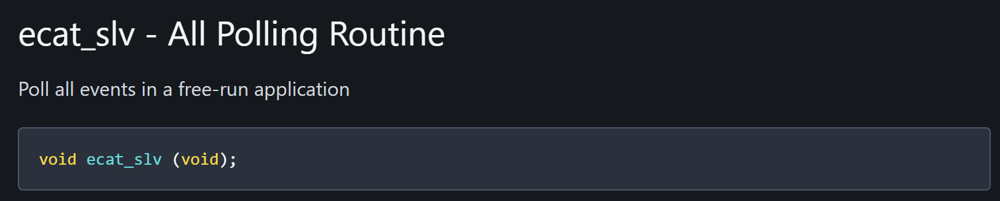

这个api的定位是：在 Free Run模式下 轮询 

看看其实现：

```c
void ecat_slv(void) {
    // 处理非实时数据
  ecat_slv_poll();
    // 处理实时 检查有无喂看门狗 | 处理RxPDO数据 | 调用App应用程序钩子函数 | 准备TxPDO数据
  DIG_process(DIG_PROCESS_WD_FLAG | DIG_PROCESS_OUTPUTS_FLAG |
              DIG_PROCESS_APP_HOOK_FLAG | DIG_PROCESS_INPUTS_FLAG);
}
```

由于是FreeRun模式，可以理解为从站完全依靠本地时钟（mcu时钟），也即不参与和其他从站包括主站的同步，所以没有外部中断信号，同时要求在while(1)中调用ecat_slv，来满足处理实时数据的要求


而这其实，也是对应数据手册中的部分：

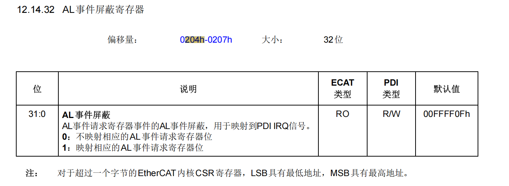

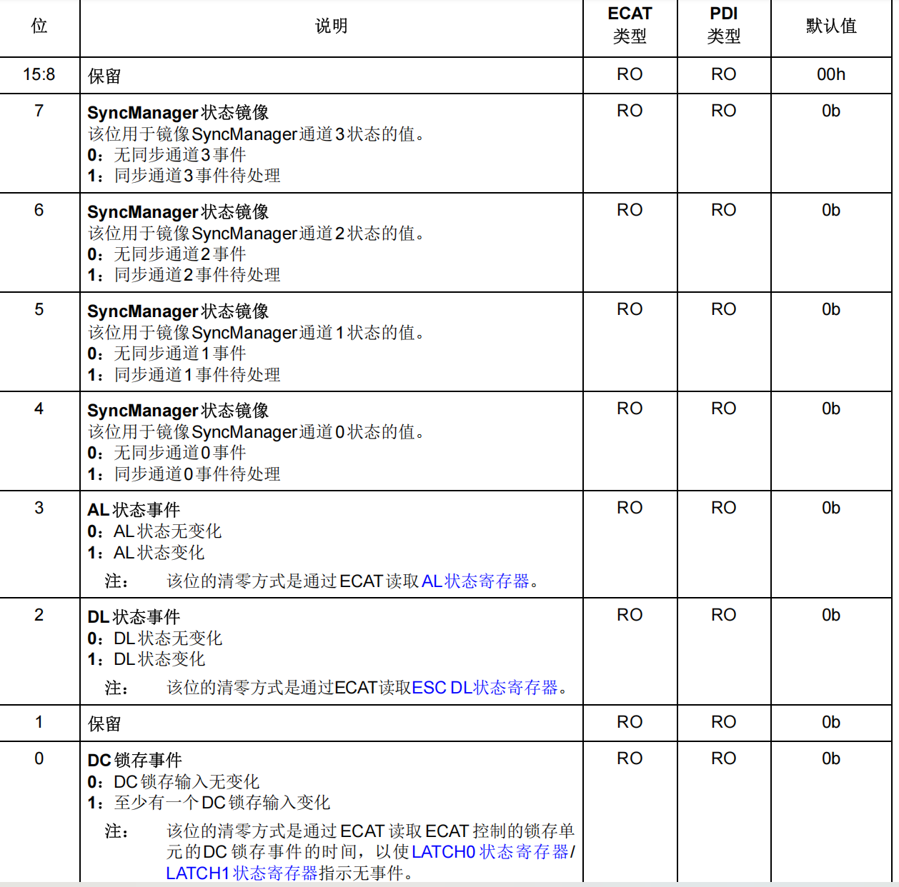

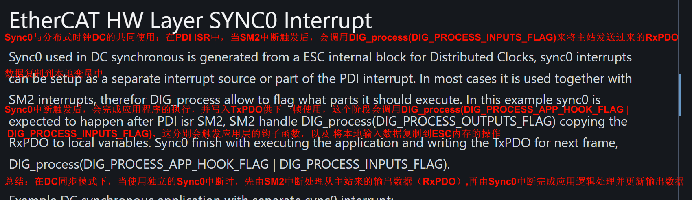


---

看官网示例的一个疑惑：

```c
static esc_cfg_t config =
{
..
   .use_interrupt = 1,
   .esc_hw_interrupt_enable = ESC_interrupt_enable,
   .esc_hw_interrupt_disable = ESC_interrupt_disable,
..
};
void main_run(void * arg)
{
    ecat_slv_init(&config);
    while(1)
    {
        /* Kick watchdog with watchdog count intervals */
        DIG_process(DIG_PROCESS_WD_FLAG);
        task_delay(1)
    }
}
```

说是`DIG_process(DIG_PROCESS_WD_FLAG);`是监视 主站是否很久没有传输数据，但是之前一直以为`DIG_process(DIG_PROCESS_WD_FLAG);`是“喂”的动作，其实不然，这个动作是检查事件组中，看门狗是否被喂过，没有的话，则看门狗计数值-1（SOES实现的软件看门狗是设定一个最大值，然后这个值会一直递减直到被喂养）

那喂的动作是哪里呢？

其实是主站传输数据（也即事件发生），会将看门狗那个位置位，从而实现“喂狗”动作


对应手册上：

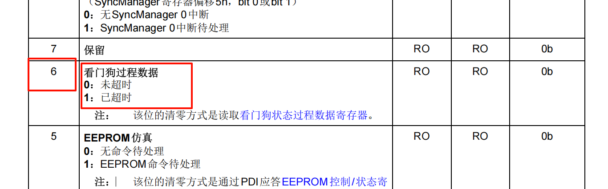

再看看当我们传入`DIG_PROCESS_WD_FLAG`时`DIG_process`中具体是怎么处理的：

```c
void DIG_process(uint8_t flags) {
  /* Handle watchdog 如果传入的是看门狗标志位 */
  if ((flags & DIG_PROCESS_WD_FLAG) > 0) {
    if (CC_ATOMIC_GET(watchdog) > 0) {  // 检查看门狗是否超时
      CC_ATOMIC_SUB(watchdog, 1);       // 看门狗计数-1
    }

    if ((CC_ATOMIC_GET(watchdog) <= 0) &&  // 如果超时
        ((CC_ATOMIC_GET(ESCvar.App.state) & APPSTATE_OUTPUT) > 0)) {
      DPRINT("DIG_process watchdog expired\n");
      ESC_ALstatusgotoerror(
          (ESCsafeop | ESCerror),
          ALERR_WATCHDOG);  // 将从站状态切换到安全状态，并上报看门狗错误
    } else if (((CC_ATOMIC_GET(ESCvar.App.state) & APPSTATE_OUTPUT) == 0)) {
      CC_ATOMIC_SET(watchdog, ESCvar.watchdogcnt);
    }
  }
    
  ...
}
```

可以看到它只是去检查计数值，我们称之为软件上的看门狗检查；疑惑：那哪里给它提供watchdog的计数值呢？当我喂狗时，我的watchdog在哪里重装载呢？

这里我们称之为硬件上的看门狗检查，为什么叫硬件上呢？因为它需要通过读取寄存器上关于看门狗的那一位来得之看门狗是否被“喂”

官网提供给我们较好的硬件上的看门狗检查实现方法：

```c
/** PDI ISR handler
 *
 * @param[in]   arg     = NOT USED
 */
static void ecat_isr (void * arg)
{
...
   /* SM watchdog */
   if(ESCvar.ALevent & ESCREG_ALEVENT_WD)
   {
      uint16_t wd;
      /* Ack the WD IRQ */
      wd = WD_STAT_PDATA;
      /* Check if the WD have expired and if we're in OP */
      if(((wd & 0x1) == 0)  &&
         ((CC_ATOMIC_GET(ESCvar.App.state) & APPSTATE_OUTPUT) > 0))
      {
         ESC_ALstatusgotoerror((ESCsafeop | ESCerror), ALERR_WATCHDOG);
         AL_EVENT_MASK &= ~ESCREG_ALEVENT_WD;
      }
   }
...
}
```

这就很好的满足它的目的：

- 监视主站数据传输是否被中断 --- 所以它把这个监视放在了pdi中断中，pdi响应的就是事件的中断，主站数据传输不异常，肯定会触发pdi中断，从而促进看门狗检查

那重装载呢？在where？其实就在刚刚说的`DIG_process`中，14-16行的代码

```c
void DIG_process(uint8_t flags) {
  /* Handle watchdog 如果传入的是看门狗标志位 */
  if ((flags & DIG_PROCESS_WD_FLAG) > 0) {
    if (CC_ATOMIC_GET(watchdog) > 0) {  // 检查看门狗是否超时
      CC_ATOMIC_SUB(watchdog, 1);       // 看门狗计数-1
    }

    if ((CC_ATOMIC_GET(watchdog) <= 0) &&  // 如果超时
        ((CC_ATOMIC_GET(ESCvar.App.state) & APPSTATE_OUTPUT) > 0)) {
      DPRINT("DIG_process watchdog expired\n");
      ESC_ALstatusgotoerror(
          (ESCsafeop | ESCerror),
          ALERR_WATCHDOG);  // 将从站状态切换到安全状态，并上报看门狗错误
    } else if (((CC_ATOMIC_GET(ESCvar.App.state) & APPSTATE_OUTPUT) == 0)) {
      CC_ATOMIC_SET(watchdog, ESCvar.watchdogcnt);
    }
  }
    
  ...
}
```


---

接着来看两段代码示例：

```c
void pdi_isr (void * arg)
{
   /* High prio interrupt used for synchronization */
   if(ESCvar.ALevent & ESCREG_ALEVENT_SM2)
   {
      /* If DC sync is not active, run the application, all except for the Watchdog */
      if(ESCvar.dcsync == 0)
      {
         DIG_process(DIG_PROCESS_OUTPUTS_FLAG | DIG_PROCESS_APP_HOOK_FLAG |
               DIG_PROCESS_INPUTS_FLAG);
      }
      /* If DC sync is active, call output handler only */
      else
      {
         DIG_process(DIG_PROCESS_OUTPUTS_FLAG);
      }
   }
}
```


```c
// update ESCvar.ALevent by reading anything over PDI 通过阅读PDI上的任何内容来更新ESCvar.ALevent
#define ESC_updateALevent() ESC_read(ESCREG_LOCALTIME, (void *)&ESCvar.Time, sizeof(ESCvar.Time))
```

这一规范是EtherCAT ESC （从站控制器） 的设计和文档规定：

- 根据ESC的设计，任何通过PDI接口对ESC寄存器的访问（如读取本地时间寄存器ESCREG_LOCALTIME）都会触发ESC内部对ALevent寄存器（或相关变量）的更新。
- 具体来说，读取ESCREG_LOCALTIME不仅是为了获取本地时间数据，同时也是一种“触发”操作，使得ESC能够检测到PDI访问，从而拉取最新的事件信息，更新全局变量（例如ESCvar.Time或ALevent）。
- 这种设计允许应用层在无需单独请求事件状态的情况下，仅通过常规寄存器访问，来保证应用层看到的是最新的事件状态


还有一个软件看门狗 和硬件看门狗的概念

在soes 软件栈的实现中，有两个看门狗的设计、


所以，官网其实分了三种模式：FreeRun 模式 、Mixed-polling 模式（DC 和 SM 共同使用）、interrupt 模式 （单使用DC模式 或者 单使用SM模式）

---

## 使用FreeRun模式开发

- 配置结构体`esc_cfg_t`
- 失能PDI 中断
- 失能 SyncX 中断
- 在while(1) 循环调用 `ecat_slv()`

## 使用Mixed Polling 模式开发

- 配置结构体`esc_cfg_t`,并调用 `esc_slv_init(&config);`进行实例的初始化（其实就是一个拷贝函数）

  ```c
  static esc_cfg_t config =
  {
     /* User input to stack */
     .user_arg = NULL, /* passed along to ESC_config and ESC_init */
  
     /* Mandatory input to stack */
     .use_interrupt = 1, /* flag telling the stack if the user application will use
                            interrupts, 0= Polling, 1 = Mixed Polling/Interrupt
                            and Interrupt */
  
     .watchdog_cnt = 100, /* non UNIT watchdog counter, for the application
                             developer to decide UNIT. This example set 100
                             cnt and by calling ecat_slv or
                             DIG_process(DIG_PROCESS_WD_FLAG) every 1ms,
                             it creates a watchdog running at ~100ms. */
  
     /* Optional input to stack for user application interaction with the stack
      * all functions given must be implemented in the application.
      */
     .set_defaults_hook = NULL, /* hook called after stack have loaded known
                                   default values, possible for application
                                   to load values not known in compile time
                                   or that need to be overwritten */
     .pre_state_change_hook = NULL, /* hook called before state transition */
     .post_state_change_hook = NULL, /* hook called after state transition */
  
     .application_hook = NULL, /* hook in application loop called when
                                  DIG_process(DIG_PROCESS_APP_HOOK_FLAG) */
     .safeoutput_override = NULL, /* user override of default safeoutput when stack
                                     stop outputs */
  
     .pre_object_download_hook = NULL, /* hook called before object download,
                                          if hook return != 0 the download will not
                                          take place */
     .post_object_download_hook = NULL, /* hook called after object download */
  
     .rxpdo_override = NULL, /* user override of default rxpdo */
     .txpdo_override = NULL, /* user override of default txpdo */
  
     /* Mandatory input to stack for SM and DC synchronous applications */
     .esc_hw_interrupt_enable = NULL, /* callback to function that enable IRQ
                                         based on the Event MASK */
     .esc_hw_interrupt_disable = NULL, /* callback to function that disable IRQ
                                          based on the Event MASK */
  
     /* Mandatory input for emulated eeprom */
     .esc_hw_eep_handler = NULL /* callback to function that handle an emulated eeprom */
  
     /* Mandatory if Distributed Clocks get activated by the master */
     .esc_check_dc_handler = NULL /* Check DC synchronous settings, must be set if
                                    DC synchronisation activated, or state change
                                    PREOP->SAFEOP will fail.
  };
  ```

- 使能PDI中断，设置掩码只允许SM2事件触发PDI 中断

- 使能Sync0 中断

- 周期调用 `ecat_slv_poll()`

- 周期调用 DIG_process(DIG_PROCESS_WD_FLAG) 来activate 软件看门狗 


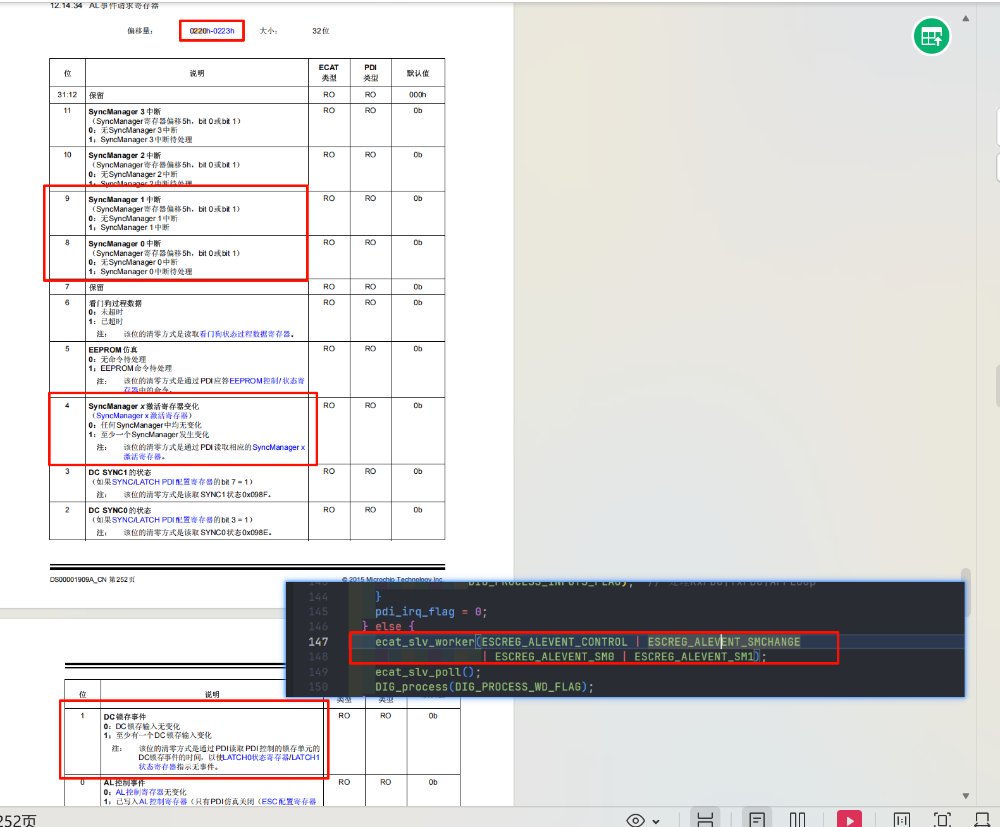


# 2. 功能实现

拷贝上的局限：其实同步性能很大程度上取决于拷贝的速度

来看看关键这部分：

比如在DIG_Process中

看到TXPDO_update 和 RXPDO_update

里面有两个关键函数：

COE_pdoPack  和 COE_pdoUnpack

让我们看看他们的实现：

```c++
void COE_pdoPack (uint8_t * buffer, int nmappings, _SMmap * mappings)
{
   int ix;

   /* Check that buffer is aligned on 64-bit boundary */
   CC_ASSERT (((uintptr_t)buffer & 0x07) == 0);

   for (ix = 0; ix < nmappings; ix++)
   {
      const _objd * obj = mappings[ix].obj;
      uint16_t offset = mappings[ix].offset;

      if (obj != NULL)
      {
         if (obj->bitlength > 64)
         {
            memcpy (
               &buffer[BITS2BYTES (offset)],
               obj->data,
               BITS2BYTES (obj->bitlength)
            );
         }
         else
         {
            /* Atomically get object value */
            uint64_t value = COE_getValue (obj);
            COE_bitsliceSet (
               (uint64_t *)buffer,
               offset,
               obj->bitlength,
               value
            );
         }
      }
   }
}

void COE_pdoUnpack (uint8_t * buffer, int nmappings, _SMmap * mappings)
{
   int ix;

   /* Check that buffer is aligned on 64-bit boundary */
   CC_ASSERT (((uintptr_t)buffer & 0x07) == 0);

   for (ix = 0; ix < nmappings; ix++)
   {
      const _objd * obj = mappings[ix].obj;
      uint16_t offset = mappings[ix].offset;

      if (obj != NULL)
      {
         if (obj->bitlength > 64)
         {
            memcpy (
               obj->data,
               &buffer[BITS2BYTES (offset)],
               BITS2BYTES (obj->bitlength)
            );
         }
         else
         {
            /* Atomically set object value */
            uint64_t value = COE_bitsliceGet (
               (uint64_t *)buffer,
               offset,
               obj->bitlength
            );
            COE_setValue (obj, value);
         }
      }
   }
}
```

 


# 3. 改进尝试

